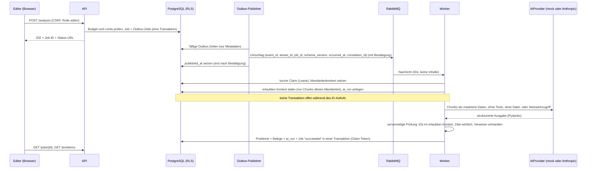

# Datenfluss zur KI

## Was das Modell sieht

* Nur den Text der ausgewählten Fundstellen (Chunk-ID und Text, optional Datum und Segment). Keine Kundennamen, keine E-Mail-Adressen, keine Beträge.
* Die Texte stehen escaped in `<untrusted_data>`-Blöcken. Der Systemprompt sagt ausdrücklich, dass diese Inhalte Daten Dritter sind und keine Anweisungen.
* Es werden keine Tools, Dateien, Netzwerkaktionen oder Schreibrechte angeboten. Die Ausgabe ist ein typisiertes JSON, das nichts auslösen kann.

## Was serverseitig geprüft wird (`ai/verification.py`)

1. Jede `source_chunk_id` muss im erlaubten Kontext dieses Laufs liegen (damit auch dem richtigen Mandanten gehören). Fremde IDs werden verworfen und gezählt.
2. Jedes Zitat muss wörtlich (Groß-/Kleinschreibung und Leerraum ignoriert) im zitierten Chunk stehen. Gespeichert wird der Originalausschnitt, nicht die Modellformulierung.
3. Ein Problem braucht mindestens einen unterstützenden, geprüften Beleg.
4. Begründungsentwürfe: jede Behauptung braucht mindestens eine gültige Chunk-ID oder eine Ergebnis-ID (`calc:<problem>:<kennzahl>:v1`) aus dem Snapshot. Zahlen kommen
   nur über berechnete Ergebnisse, Rohquelle und berechnetes Ergebnis sind getrennte Belegarten.
5. Das Prüfergebnis wird in `ai_runs.verification` gespeichert und in der Oberfläche angezeigt.

## Was die KI nicht darf

Rollen ändern, Mails senden, Daten löschen, Freigaben erteilen, Aufwände oder Erfolgswahrscheinlichkeiten erfinden. Sie schreibt Vorschläge (`status = proposed`) und Entwurfstexte (`ai_draft`),
beides sichtbar als KI-Ergebnis. Entscheidung und Freigabe bleiben menschlich (Vier-Augen-Prinzip).

## Demo-Adapter und echter Anbieter

* `AI_PROVIDER=mock`: deterministisches lexikalisches Clustering (TF-IDF, Zentroid-Linkage) und regelbasierte Entwurfstexte aus den tatsächlich importierten Daten und berechneten Kennzahlen.
  Kein Sprachmodell, keine externen Aufrufe, überall mit dem Etikett „Demo-KI“. Er bestätigt keine Qualität eines echten Modells.
* `AI_PROVIDER=anthropic`: offizielles SDK, strukturierte Ausgabe über `messages.parse` mit Pydantic-Schema, Modell aus `ANTHROPIC_MODEL`, Timeout und begrenzte Wiederholungen,
  Größenlimit für den Kontext, monatliches Aufrufbudget je Mandant. Fehler (Timeout, Rate-Limit, Ablehnung) enden als sichtbarer Jobfehler, **nie** als stiller Wechsel auf den Demo-Adapter.
  Kosten werden nur gespeichert, wenn `AI_PRICE_INPUT_PER_MTOK` und `AI_PRICE_OUTPUT_PER_MTOK` konfiguriert sind.
* Geprüft: Anfrageaufbau, Fehlerabbildung und Ablehnungsbehandlung gegen einen Stub des SDK-Clients (`tests/unit/test_ai.py`). **Nicht geprüft:** echte Aufrufe (kein API-Schlüssel im Test).
