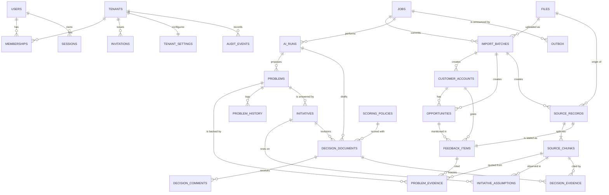

# Datenmodell

Alle Tabellen entstehen durch die Alembic-Migrationen in `backend/migrations/sql/` (0001 bis 0005). Die ORM-Modelle in
`backend/src/decision_evidence/db/models.py` spiegeln sie; `tests/integration/test_schema.py` schlägt fehl, wenn Spalten auseinanderlaufen.

## Schemas

| Schema | Inhalt | Zugriff |
|---|---|---|
| `identity` | globale Identitätsdaten: `users`, `tenants`, `memberships`, `sessions`, `invitations`, `login_attempts` | nur Rolle `de_auth` (kleine Repository-Schicht `identity/repository.py`), keine RLS, ADR 0002 |
| `app` | alle Fachtabellen, jede mit `tenant_id NOT NULL`, `UNIQUE (tenant_id, id)`, ENABLE und FORCE RLS | Rollen `de_app`, `de_worker`, `de_migrator` unter Mandantenkontext |
| `infra` | `outbox`, `alembic_version`, Hilfsfunktionen (`current_tenant_id()`, Recovery-Funktionen) | siehe [Grant-Matrix](grant-matrix.md) |

## ER-Diagramm

Fremdschlüssel zwischen `app`-Tabellen sind immer zusammengesetzt `(tenant_id, <id>) -> parent(tenant_id, id)`, im Diagramm aus Platzgründen als einfache
Beziehung gezeichnet. Ein Verweis über Mandantengrenzen scheitert dadurch in der Datenbank.

## Tabellen aus dem Pflichtmodell

Spaltenlisten wie in der Aufgabe; Ergänzungen sind **fett**.

| Tabelle | Bedeutung und wichtige Constraints |
|---|---|
| `app.files` | Metadaten hochgeladener Dateien. Schlüssel `tenant/<uuid>/<zufall>`, per CHECK an das Tenant-Präfix gebunden. Status `pending/ready/failed/deleting`, Größe 1 Byte bis 100 MB, sha256. **`failure_code`** |
| `app.source_records` | eine Quelle (Feedbackzeile, Notiz, Dokument) mit `origin` original/imported/synthetic, `content_hash` (UNIQUE je Mandant = Dublettenschutz), `metadata` JSONB. **`import_batch_id`, `source_kind`** |
| `app.source_chunks` | Fundstellen: `ordinal`, `text`, `locator` JSONB (Datei, Zeile, Seite, Absatz). **`search_vector`** (generierte tsvector, GIN) für die Volltextsuche |
| `app.jobs` | Hintergrundaufgaben, `UNIQUE (tenant_id, kind, idempotency_key)`, Lease (`lease_expires_at`, **`claim_token`**), Versuche. **`max_attempts`, `error_message`, `correlation_id`** |
| `app.ai_runs` | jeder KI-Aufruf: Anbieter (`mock`, `anthropic`, `ollama`), Modell, Prompt-Version, Eingabe-Hash, Tokens, Dauer. Kosten (`estimated_cost`, Währung) nur bei konfigurierter Preisbasis (`price_basis`). **`purpose`, `verification`** (Ergebnis der serverseitigen Belegprüfung) |
| `app.audit_events` | nur anhängbar (Trigger verbietet UPDATE/DELETE, Rolle ohne diese Rechte). **`request_id`** |
| `infra.outbox` | nur Vermittlungsmetadaten (Job-ID, Ereignistyp, Schema-Version, Verfügbarkeit, Versuche). **`correlation_id`** |
| `app.customer_accounts` | `commercial_value NUMERIC(18,2)` nullable, `value_basis` arr/annual_sales/unknown, ISO-Währung. CHECK: bekannter Wert braucht Basis und Währung, `unknown` trägt nie eine Zahl (kein erfundenes 0) |
| `app.opportunities` | Phase open/won/lost/no_decision, Betrag nullable, Währung Pflicht bei Betrag, offene Chancen ohne Abschlussdatum |
| `app.feedback_items` | Aussage mit Kunde (nullable), Opportunity (nullable), Kanal, Zeitpunkt, `body`. Importidentität über `source_records.content_hash` und partiellen UNIQUE auf `external_id` |
| `app.problems` | Status proposed/confirmed/archived, `version` für optimistische Sperre. **`origin` (ai/manual/split), `created_by_job_id`+`job_ordinal` (UNIQUE: ein erneut zugestellter Job legt Vorschläge nicht doppelt an), `ai_run_id`, `merged_into_problem_id`** |
| `app.problem_evidence` | Problem, Feedback, Chunk, Beziehung supports/contradicts/context, wörtliches Zitat, `human_verified`. UNIQUE (Problem, Chunk). Trigger prüft, dass der Chunk zum Feedbackeintrag gehört. **`origin`, `ai_run_id`, `verified_by/at`** |
| `app.initiatives` | Aufwand low/high (nullable, nur Schätzung des Teams), Einheit, Status, `version`. CHECK low <= high |
| `app.initiative_assumptions` | observed/estimate/hypothesis; CHECK: `observed` braucht eine Quelle (`source_chunk_id`) |
| `app.scoring_policies` | Gewichte als JSONB, per CHECK-Funktion auf erlaubte Kriterien und Summe 1 geprüft. **`parameters`** (Währung, Aufwandsreferenz), genau eine aktive Policy je Mandant |
| `app.decision_documents` | Revisionen je Initiative, Zustände draft/in_review/approved/superseded, `options`, `evidence_snapshot`, `scoring_snapshot`. Trigger macht freigegebene Revisionen unveränderlich (einziger erlaubter Übergang approved -> superseded). Höchstens eine offene und eine freigegebene Revision je Initiative. **`title`, `ai_draft`, `scoring_policy_id`, `snapshot_taken_at`, `submitted_by`, `version`** |
| `app.decision_comments` | Kommentare, auch nach Freigabe möglich |
| `app.decision_evidence` | referenzielle Verknüpfung der eingefrorenen Belege (FK `ON DELETE RESTRICT` auf Chunks). **`quote`** |

## Zusätzliche Tabellen (ergänzt, weil echte Abläufe sie brauchen)

| Tabelle | Zweck |
|---|---|
| `app.tenant_settings` | Grenzen je Mandant (Dateigröße, Importzeilen, laufende Jobs, KI-Monatsbudget, Kontextgröße), Aktualität von Belegen, Selbstfreigabe |
| `app.import_batches` | Importassistent: Datei, Zuordnung, Optionen, Vorschau, Ergebnis, Job. Status uploaded/previewed/committing/committed/failed |
| `app.problem_history` | nachvollziehbare Historie für Zusammenführen, Aufteilen, Zuordnungskorrekturen (nur anhängbar) |
| `identity.login_attempts` | kurzlebige OIDC-Anmeldeversuche (State-Hash, Nonce, verschlüsselter PKCE-Verifier), einmalig verbrauchbar |

## Konventionen

* UUID-Primärschlüssel, `timestamptz` in UTC, Anzeige in der Zeitzone des Mandanten. Geld als `NUMERIC(18,2)` mit ISO-Währung, nie Gleitkomma.
* Löschregeln: Quellen löschen kaskadiert über Fundstellen, Feedback und Belege; sie wird mit 409 verweigert, solange Entscheidungsdokumente oder Annahmen darauf verweisen.
* JSONB nur für variable Strukturen (Locator, Metadaten, Snapshots, Gewichte), nicht als Ersatz für Beziehungen.
