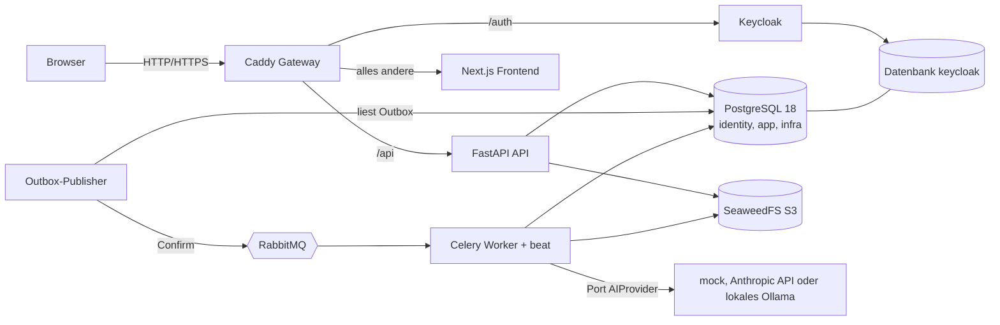

# Architekturüberblick

Modularer Monolith: eine deployte Backend-Anwendung mit klar getrennten Modulen, dazu Worker, Outbox-Publisher und ein Next.js-Frontend hinter einem Gateway.

## Prozesse und Rollen

| Prozess | Aufgabe | Datenbankrolle | Zugriff auf |
|---|---|---|---|
| `gateway` | einziger veröffentlichter Port (nur 127.0.0.1 im Demo-Modus) | | api, keycloak, frontend |
| `frontend` | Oberfläche, deutsch, TanStack Query gegen `/api` | | nur API über das Gateway |
| `api` | REST, Autorisierung, Anfragen kurz halten | `de_auth` + `de_app` | PostgreSQL, S3 |
| `worker` | Import-Commit, Analyse, Export, Aufräumen (`-B` für beat) | `de_worker` | PostgreSQL, S3, RabbitMQ, KI-Anbieter |
| `outbox-publisher` | Outbox nach RabbitMQ | `de_outbox` | PostgreSQL (Metadaten), RabbitMQ |
| `migrate` / `db-init` / `bootstrap` | einmalige Aufgaben vor dem Start | `de_migrator`, Superuser nur für `db-init` | PostgreSQL |
| `keycloak` | OIDC | `keycloak` (eigene DB) | |
| `storage` | SeaweedFS (Master, Volume, Filer, S3) | | |

## Module im Backend (`backend/src/decision_evidence`)

`identity` (OIDC, Sitzungen, Einladungen) · `tenancy` (Mandantenkontext, Rollenprüfung) · `db` (Engines, Sessions, ORM) · `jobs` (Outbox, Publisher, Runner, Worker) ·
`ai` (Port, Mock, Anthropic, Verifikation) · `modules/imports` · `customers` (Kataloge, Quellen, Dateien) · `feedback` · `metrics` · `scoring` · `analysis` ·
`problems` · `initiatives` · `decisions` (Revisionen, Freigabe, Export) · `exports` · `dashboard` · `members` (Einstellungen, Mitglieder, Audit) · `observability` · `tools` (Seed, Bootstrap, Admin, OpenAPI-Export).
Module sprechen sich über Funktionsaufrufe an, nicht über HTTP. Fachlogik ohne Datenbank (`domain`) ist getrennt von Persistenz (`service`) und HTTP (`api`).

## Hauptablauf Daten zu Entscheidung

1. **Import** (Assistent: Datei, Zuordnung, Vorschau mit Zeilenfehlern, Commit als Job) legt Kunden, Chancen, Quellen, Fundstellen und Feedback an.
2. **Analyse** (Job) schlägt Probleme mit Belegen vor; Server prüft Zitate und IDs.
3. **Beleg öffnen**: jedes Zitat führt zur Fundstelle (Datei, Zeile/Absatz) und zur Originaldatei.
4. **Cluster korrigieren**: Zusammenführen, Aufteilen, Beleg verschieben oder entfernen, Beziehung ändern, mit Historie.
5. **Initiative** anlegen (Aufwand, Risiko, Annahmen als beobachtet, geschätzt, vermutet).
6. **Entscheidungsentwurf** (KI-gestützt oder manuell): Snapshot, Kennzahlen, Scoring mit Sensitivität.
7. **Freigabe** (Vier-Augen), danach unveränderlich; **Export** als Markdown, Belege als CSV und Bewertung als CSV.

Alles, was nicht innerhalb weniger hundert Millisekunden erledigt ist, läuft als Job mit sichtbarem Status.

## Beobachtbarkeit

Strukturierte JSON-Logs mit `request_id`/`correlation_id`, Jobs tragen die ID der auslösenden Anfrage. Gesundheitsendpunkte: `/api/health/live` (Prozess) und `/api/health/ready`
(Datenbank, Migrationsstand, Speicher). Fachinhalte, Tokens und Geheimnisse werden nicht geloggt.
