# Benutzerhandbuch decision-evidence

decision-evidence hilft kleinen B2B-Produktteams, Priorisierungsentscheidungen vorzubereiten. Sie importieren Kundenstammdaten, Verkaufschancen, Feedback und Gesprächsnotizen. Das Werkzeug
schlägt Problemcluster vor, zeigt zu jedem Problem die Originalbelege und den wirtschaftlichen Kontext und führt Sie zu einer prüfbaren, freigegebenen Entscheidungsvorlage.

**Die KI schlägt vor, das Team entscheidet.** Das Werkzeug trifft keine Entscheidung, gibt keine Roadmap-Zusage und schreibt in kein CRM.

Alle Screenshots stammen aus dem Demo-Betrieb mit synthetischen Daten. Dort ist ein deterministischer Demo-Adapter statt eines Sprachmodells aktiv, erkennbar an der Markierung „Demo-KI“.
Die Bilder wurden mit dem Skript `tests/e2e/screenshots/capture.spec.ts` aus der laufenden Anwendung erzeugt (siehe [Screenshots neu erstellen](#16-screenshots-neu-erstellen)).

## Inhalt

1. [Das Wichtigste in Kürze](#1-das-wichtigste-in-kürze)
2. [Anmelden und Workspace wählen](#2-anmelden-und-workspace-wählen)
3. [Die Oberfläche](#3-die-oberfläche)
4. [Übersicht](#4-übersicht)
5. [Daten importieren](#5-daten-importieren)
6. [Quellen, Suche, Kunden und Opportunities](#6-quellen-suche-kunden-und-opportunities)
7. [Analyse und Probleme](#7-analyse-und-probleme)
8. [Belege prüfen und Probleme korrigieren](#8-belege-prüfen-und-probleme-korrigieren)
9. [Initiativen und Annahmen](#9-initiativen-und-annahmen)
10. [Entscheidungsvorlage, Freigabe und Export](#10-entscheidungsvorlage-freigabe-und-export)
11. [Vergleich und Scoring](#11-vergleich-und-scoring)
12. [Aufgaben im Hintergrund](#12-aufgaben-im-hintergrund)
13. [Mitglieder, Einstellungen und Audit](#13-mitglieder-einstellungen-und-audit)
14. [Rollen und Berechtigungen](#14-rollen-und-berechtigungen)
15. [Begriffe, Rechenregeln und häufige Fragen](#15-begriffe-rechenregeln-und-häufige-fragen)
16. [Screenshots neu erstellen](#16-screenshots-neu-erstellen)

---

## 1. Das Wichtigste in Kürze

Der Weg von den Rohdaten zur Entscheidung hat acht Schritte. Jeder Schritt hat in diesem Handbuch ein eigenes Kapitel.

| Schritt | Was Sie tun | Kapitel |
|---|---|---|
| 1. Import | Kunden, Verkaufschancen, Feedback als CSV hochladen, Gesprächsnotizen einfügen, Vorschau prüfen, bestätigen | [5](#5-daten-importieren) |
| 2. Analyse | Die Analyse starten. Sie schlägt Problemcluster vor | [7](#7-analyse-und-probleme) |
| 3. Beleg öffnen | Zu jedem Problem die Originalstelle ansehen | [8](#8-belege-prüfen-und-probleme-korrigieren) |
| 4. Cluster korrigieren | Probleme zusammenführen, aufteilen, Belege verschieben, Beziehungen ändern | [8](#8-belege-prüfen-und-probleme-korrigieren) |
| 5. Initiative | Zu einem bestätigten Problem eine Initiative mit Annahmen und Aufwand anlegen | [9](#9-initiativen-und-annahmen) |
| 6. Entscheidungsentwurf | Zwei Optionen, Belegstand, Scoring und Begründung erfassen | [10](#10-entscheidungsvorlage-freigabe-und-export) |
| 7. Freigabe | Eine zweite Person prüft und gibt frei. Die Revision ist danach unveränderlich | [10](#10-entscheidungsvorlage-freigabe-und-export) |
| 8. Export | Markdown und CSV mit den tatsächlich gespeicherten Daten | [10](#10-entscheidungsvorlage-freigabe-und-export) |

Vier Grundsätze gelten überall:

* **Belegbar:** Jede Aussage über ein Problem führt zu einer Originalstelle mit wörtlichem Zitat. Was die KI nicht belegen kann, wird verworfen.
* **Eindeutige Kunden zählen:** Zehn Tickets desselben Kunden sind ein Kunde. Die Zahl der Aussagen steht immer daneben.
* **Keine gemischten Zahlen:** ARR, Jahresumsatz, Pipeline und verlorenes Volumen werden getrennt und je Währung ausgewiesen, nie addiert und nie umgerechnet. Fehlende Werte sind „unbekannt“, nicht 0.
* **Vier-Augen-Prinzip:** Eine Entscheidungsvorlage wird von einer anderen Person freigegeben als der, die sie eingereicht hat. Freigegebene Revisionen lassen sich nicht ändern, neue Erkenntnisse führen zu einer neuen Revision.

---

## 2. Anmelden und Workspace wählen

### Anmelden

Öffnen Sie die Adresse Ihres Servers (im lokalen Demo: `http://localhost:8480`). Klicken Sie auf **Anmelden**.

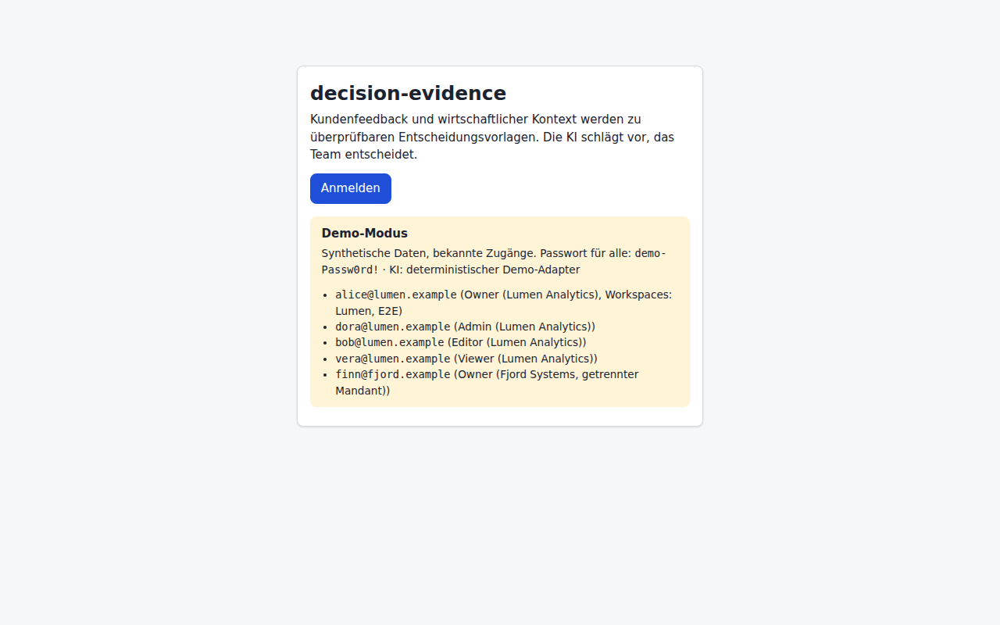

Im **Demo-Betrieb** zeigt die Startseite die Demo-Zugänge. Sie sind nur im gekennzeichneten Demomodus vorhanden. Im Produktivbetrieb gibt es diesen Kasten nicht.

Sie werden zur Anmeldung des Identity Providers (im Standard Keycloak) weitergeleitet. Dort geben Sie E-Mail-Adresse und Passwort ein.
Das Werkzeug selbst speichert kein Passwort.

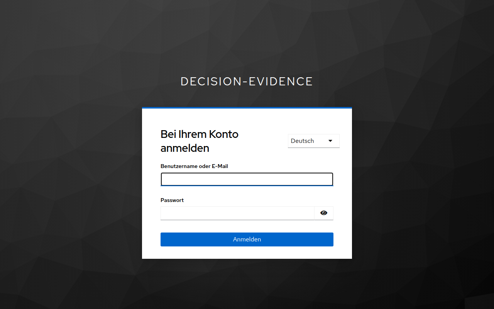

Nach mehreren Fehlversuchen (im Demo-Realm zehn) sperrt Keycloak die Anmeldung zeitweise. Das schützt vor dem Raten von Passwörtern. Zum **Abmelden** klicken Sie oben rechts auf **Abmelden**. Das beendet auch die Sitzung beim Identity Provider.

### Workspace wählen

Ein **Workspace** ist der abgeschlossene Datenbereich Ihrer Organisation. Daten verschiedener Workspaces sind vollständig getrennt, auch dann, wenn Sie in mehreren Mitglied sind.
Gehören Sie nur zu einem Workspace, öffnet er sich automatisch. Sonst wählen Sie ihn aus der Liste.

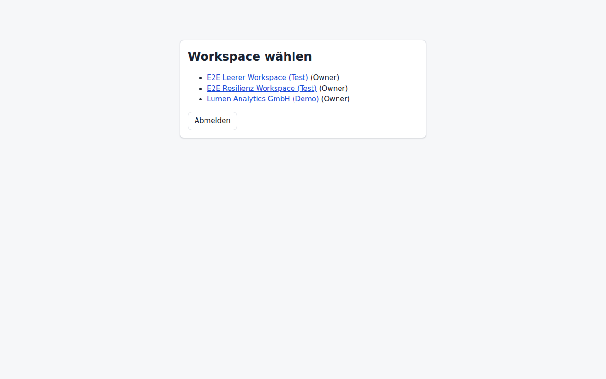

Sie sehen nur Workspaces, in denen Sie eine aktive Mitgliedschaft haben. Fehlt ein erwarteter Workspace, bitten Sie einen Admin oder Owner um eine Einladung ([Kapitel 13](#13-mitglieder-einstellungen-und-audit)).

### Workspace wechseln

Oben links finden Sie die Auswahlliste mit Ihren Workspaces, daneben Ihre **Rolle** in diesem Workspace und die Markierung **Demo-KI**, solange der Demo-Adapter aktiv ist.

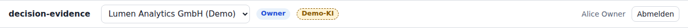

### Einladung annehmen

Wurden Sie eingeladen, öffnen Sie den Einladungslink, den Ihnen ein Admin oder Owner gegeben hat. Melden Sie sich mit **genau der Adresse** an, an die die Einladung gebunden ist,
und bestätigen Sie die Einladung. Der Link gilt einmal und sieben Tage.

---

## 3. Die Oberfläche

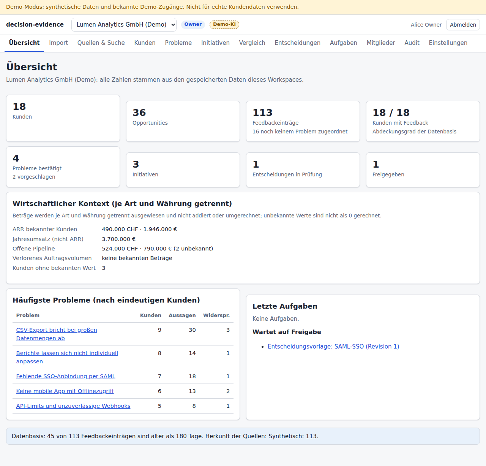

| Bereich | Bedeutung |
|---|---|
| gelbe Leiste oben | Hinweis „Demo-Modus“. Nur in Demo und Test. Im Betrieb mit echten Daten sehen Sie sie nicht |
| Kopfzeile | Workspace-Wahl, Ihre Rolle, Markierung **Demo-KI** (nur mit Demo-Adapter), Ihr Name, Abmelden |
| Navigationsleiste | Übersicht, Import, Quellen & Suche, Kunden, Probleme, Initiativen, Vergleich, Entscheidungen, Aufgaben, Mitglieder. Admins und Owner sehen zusätzlich Audit und Einstellungen |
| Inhalt | die jeweilige Seite |

**Markierungen und Zustände**

* **Demo-KI** (gelb, gestrichelt): Das Ergebnis stammt vom deterministischen Demo-Adapter, nicht von einem Sprachmodell. Qualität und Titel sind nicht mit einem echten Modell vergleichbar.
* **Vorgeschlagen / Bestätigt / Archiviert:** Zustand eines Problems. Vorschläge der Analyse sind Hypothesen, die Sie prüfen.
* **Entwurf / In Prüfung / Freigegeben / Abgelöst:** Zustand einer Entscheidungsvorlage.
* **ungeprüft / geprüft:** Ob ein Mensch einen Beleg bestätigt hat.
* Fehlende Werte erscheinen als **unbekannt**, nie als 0.

**Bedienung**

* Alles ist mit der Tastatur erreichbar. Ganz am Anfang jeder Seite steht ein Link **Zum Inhalt springen** (er wird mit Tab sichtbar). Der Fokus ist deutlich markiert.
* Dialoge schließen Sie mit der Taste Esc. Beim Öffnen springt der Fokus in den Dialog und beim Schließen zurück.
* Die Oberfläche passt sich schmalen Bildschirmen an. Tabellen lassen sich dort seitlich wischen.

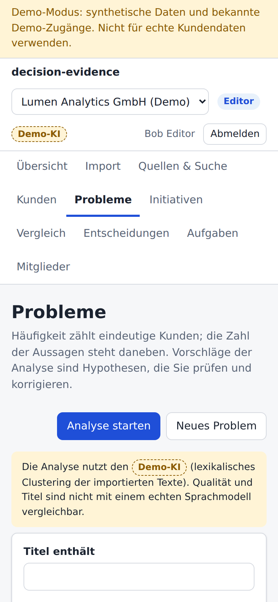

* Meldungen erscheinen kurz unten rechts. Fehler werden in roten Kästen am Ort des Geschehens erklärt, oft mit einer **Anfragenummer** für den Support.
* Hat Ihre Rolle für eine Aktion keine Berechtigung, ist die Schaltfläche ausgeblendet oder die Seite weist darauf hin ([Kapitel 14](#14-rollen-und-berechtigungen)).

---

## 4. Übersicht

Die Übersicht zeigt, was im Workspace gespeichert ist. Alle Zahlen kommen aus den Daten, nichts ist Beispieltext.

* **Kacheln:** Kunden, Opportunities, Feedbackeinträge (mit der Zahl der noch keinem Problem zugeordneten), Kunden mit Feedback (Abdeckungsgrad der Datenbasis), bestätigte und vorgeschlagene Probleme, Initiativen, Entscheidungen in Prüfung und Freigegebene.
* **Wirtschaftlicher Kontext:** ARR, Jahresumsatz, offene Pipeline und verlorenes Auftragsvolumen **getrennt** und **je Währung**, dazu die Zahl der Kunden ohne bekannten Wert.
* **Häufigste Probleme** nach eindeutigen Kunden, mit Aussagen und widersprechenden Signalen.
* **Letzte Aufgaben** und **Wartet auf Freigabe** (für Admins und Owner der direkte Weg zu offenen Entscheidungsvorlagen).
* Der blaue Hinweis am Ende nennt die Datenbasis: wie viele Einträge älter als die Aktualitätsgrenze sind und woher die Quellen stammen.

Ein frischer Workspace ist leer und führt Sie zum Import:

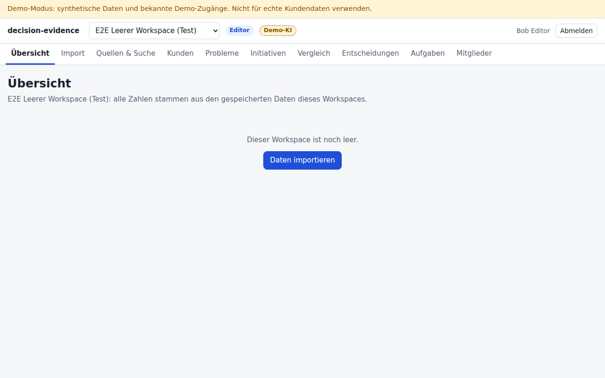

---

## 5. Daten importieren

*Wer darf das? Editor, Admin und Owner. Viewer sehen die Seite mit einem Hinweis.*

Der Import prüft alles, **bevor** etwas gespeichert wird, und speichert nur als Ganzes. Es gibt keinen stillen Teilimport.

### Welche Daten und in welcher Reihenfolge

| Art | Format | Inhalt |
|---|---|---|
| Kundenstammdaten | CSV | externe ID, Name, Segment, Land, Umsatzwert, Wertbasis (ARR oder Jahresumsatz), Währung, Stand des Werts |
| Verkaufschancen | CSV | externe ID, Kunde (externe ID), Name, Phase (offen, gewonnen, verloren, keine Entscheidung), Betrag, Währung, Abschlussdatum |
| Kundenfeedback | CSV | externe ID, Kunde, Opportunity, Kanal, Datum, Text, Sprache |
| Dokument | PDF mit Textebene, TXT, Markdown | wird in Absätze beziehungsweise Seiten als Fundstellen zerlegt |
| Gesprächsnotiz | eingefügter Text | wird in Absätze zerlegt |

Importieren Sie in dieser Reihenfolge: **Kunden, dann Opportunities, dann Feedback.** Verweise von Chancen und Feedback auf Kunden werden gegen die bereits importierten Daten geprüft.
Beispieldateien mit Erklärung liegen unter [docs/examples](../examples/README.md).

### Schritt 1: Datei wählen

Öffnen Sie **Import**. Wählen Sie die Art der Daten und die Datei. Mit „Die Daten sind synthetisch (Demo/Test)“ kennzeichnen Sie Testdaten. Klicken Sie **Hochladen und prüfen**.

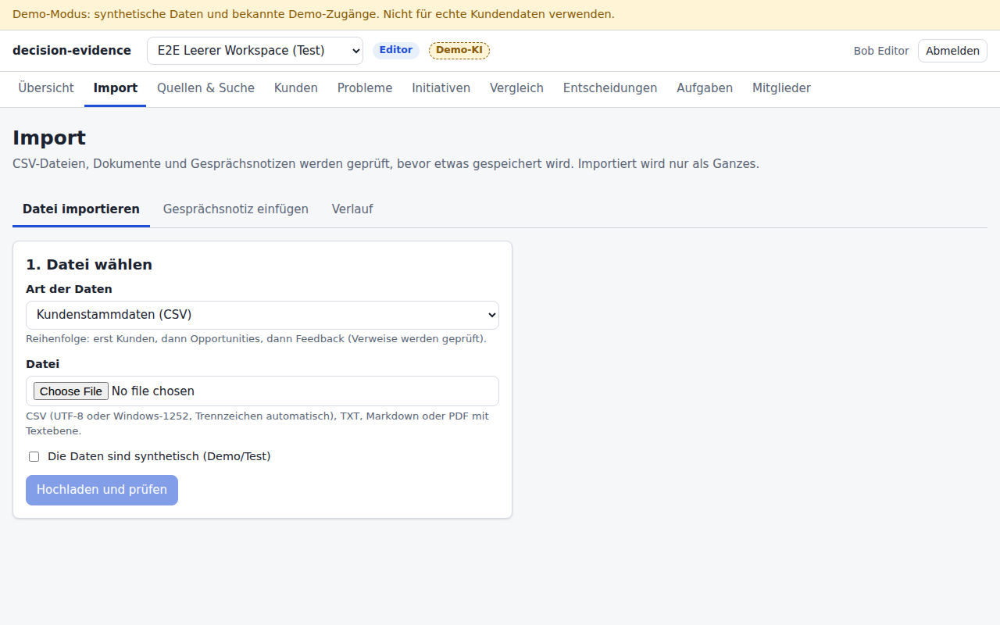

Unbrauchbare Dateien werden sofort mit einer verständlichen Meldung abgelehnt, zum Beispiel eine Datei, deren Inhalt nicht zur Endung passt (hier eine PDF-Datei, die als CSV getarnt ist):

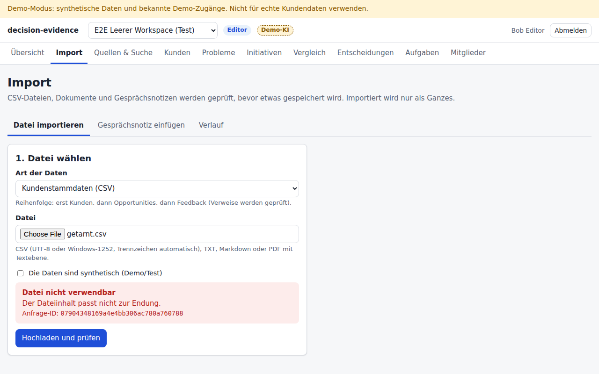

### Schritt 2: Spalten zuordnen und Vorschau berechnen

Die Spalten Ihrer Datei werden anhand der Namen vorgeschlagen (deutsch und englisch, zum Beispiel „Kundennummer“, „Firma“, „Umsatz“). Prüfen Sie die Zuordnung und ändern Sie sie bei Bedarf.
Pflichtfelder sind mit einem Stern markiert. Unter **Bereits vorhandene Datensätze** legen Sie fest, ob Einträge mit gleicher externer ID übersprungen oder aktualisiert werden.
Klicken Sie **Vorschau berechnen**.

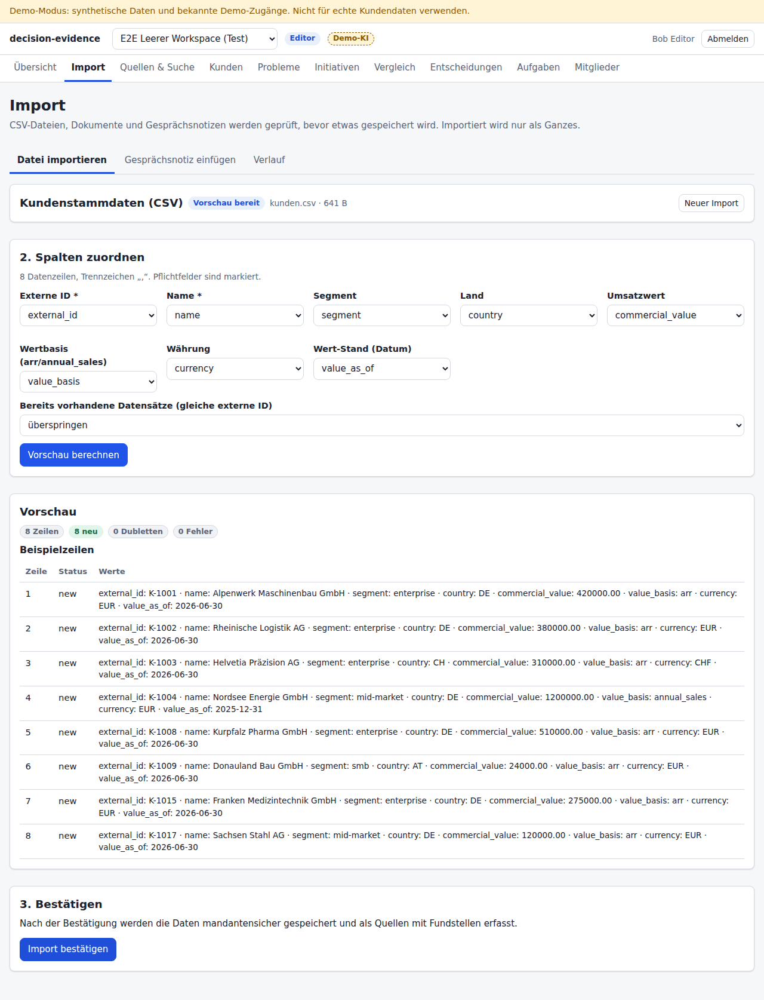

Die **Vorschau** zeigt, was passieren würde: Zeilen insgesamt, neue Einträge, Dubletten, Fehler und Zeilen mit Hinweisen, dazu Beispielzeilen.
Zahlen werden in deutscher und englischer Schreibweise erkannt (`1.234,56`, `1,234.56`, `1234.56`). Datumsangaben wie `2026-09-30` und `30.09.2026` werden verstanden.

**Fehler blockieren die Bestätigung.** Die Vorschau nennt Zeile, Feld und Problem. Korrigieren Sie die Datei und laden Sie sie erneut hoch.

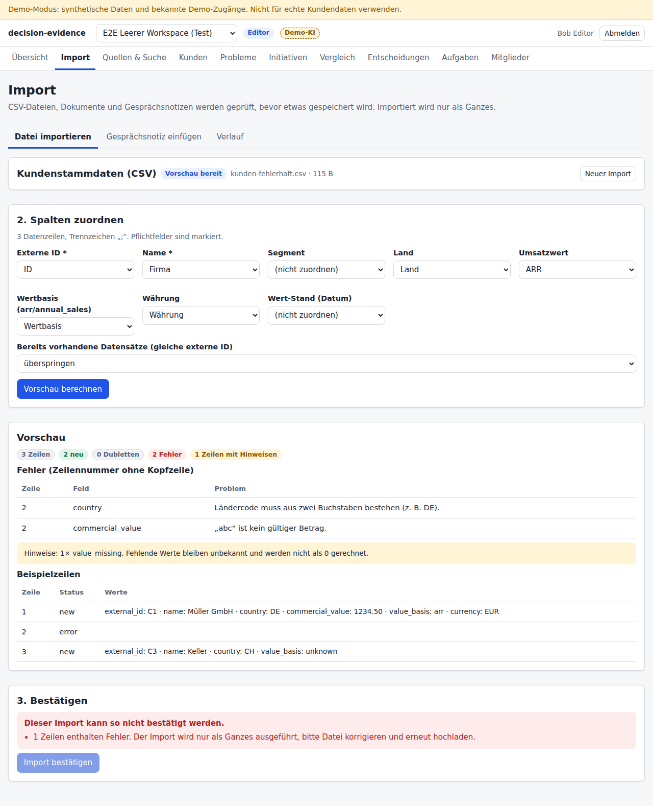

**Hinweise** (gelb) blockieren nicht. Ein typischer Hinweis: „Fehlende Werte bleiben unbekannt und werden nicht als 0 gerechnet.“

**Dubletten** erkennt das Werkzeug bei Kunden und Chancen an der externen ID, bei Feedback an einem Fingerabdruck aus Kunde und normalisiertem Text sowie an der Ticket-ID.
Dubletten werden übersprungen. Eine Datei, die schon importiert wurde, lässt sich nicht noch einmal bestätigen („nichts zu importieren“).

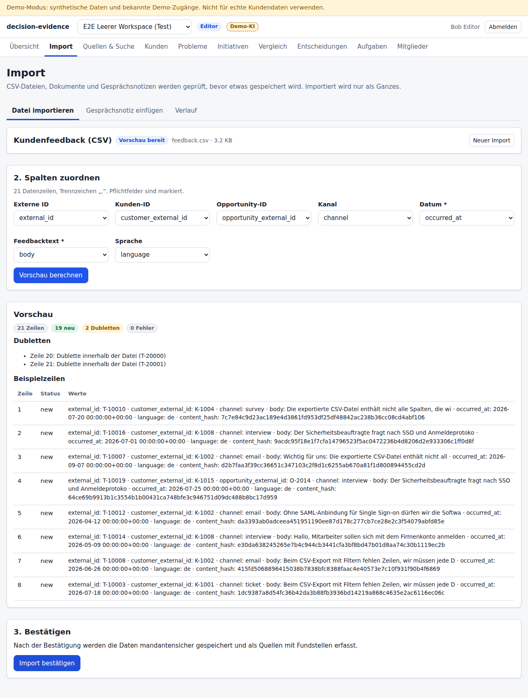

### Schritt 3: Bestätigen

Klicken Sie **Import bestätigen**. Die Daten werden als Hintergrundaufgabe in einer einzigen Transaktion gespeichert, mandantensicher und als Quellen mit Fundstellen. Das Ergebnis erscheint auf der Seite.

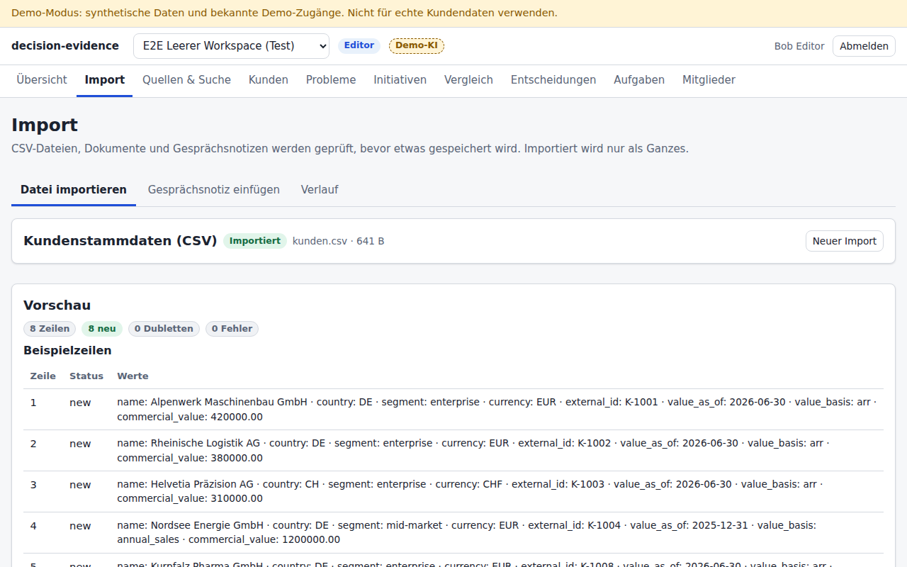

### Gesprächsnotiz einfügen

Auf dem Reiter **Gesprächsnotiz einfügen** geben Sie Titel und Text ein, optional die externe ID des Kunden, ein Datum und den Kanal. Mit **Prüfen** erhalten Sie dieselbe Vorschau.
Der Text wird in Absätze zerlegt, jeder Absatz ist später eine zitierbare Fundstelle („Absatz 2“).

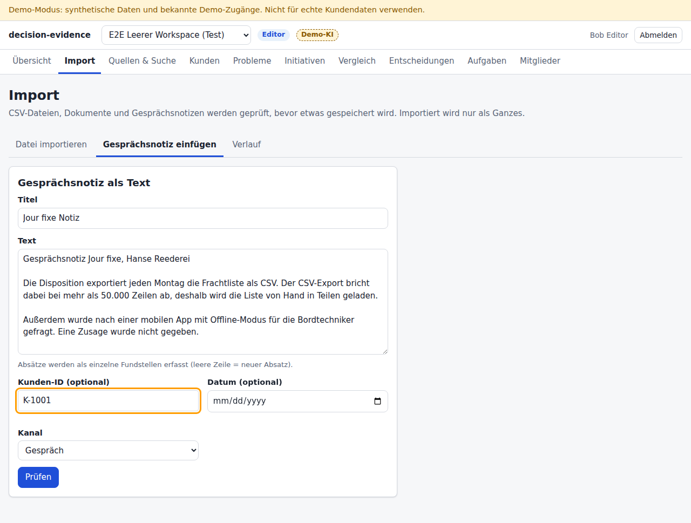

### Verlauf und Grenzen

* Der Reiter **Verlauf** listet alle Importe mit Status (Hochgeladen, Vorschau bereit, Wird importiert, Importiert, Fehlgeschlagen). **Öffnen** zeigt Vorschau und Ergebnis erneut.
* Standardgrenzen: 10 MB je Datei und 5000 Zeilen je Import. Admins ändern sie in den Einstellungen.
* PDF-Scans ohne Textebene werden als solche gemeldet („Keine Textebene“). Es findet keine Texterkennung (OCR) statt und es wird kein Text erfunden.
* Dateien mit Windows-1252-Zeichensatz und Semikolon als Trennzeichen werden erkannt.

Nach dem Import zeigt die Übersicht die tatsächlichen Zahlen, hier mit zwei Währungen getrennt:

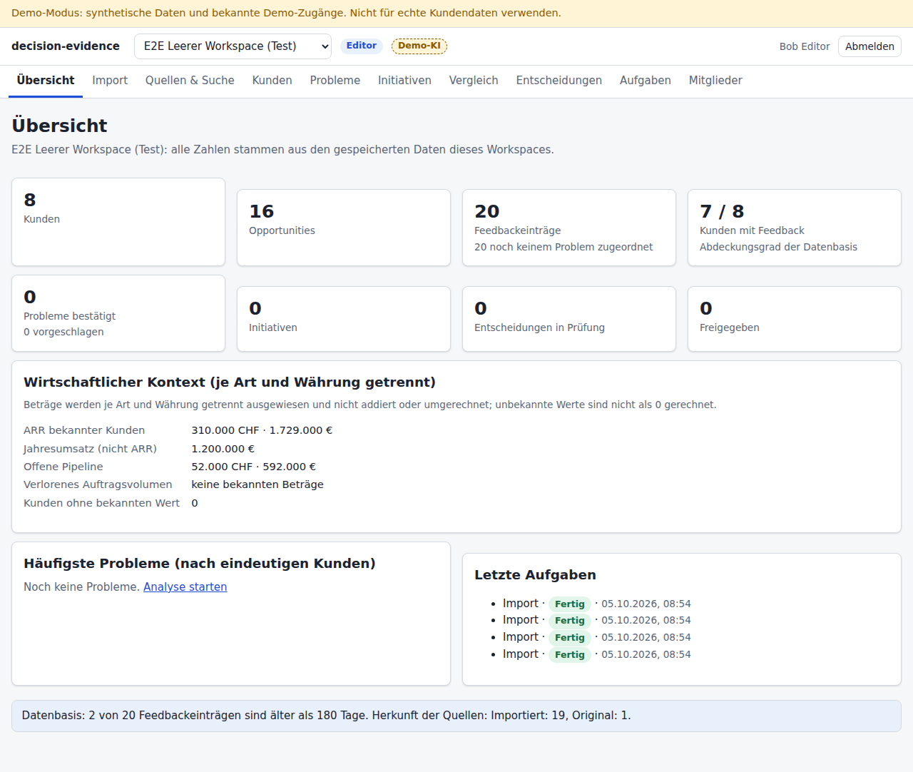

---

## 6. Quellen, Suche, Kunden und Opportunities

### Quellen & Suche

Hier durchsuchen Sie alle importierten Aussagen im Volltext und sehen die Originalquelle mit ihren Fundstellen.

* Reiter **Feedback durchsuchen:** Suchbegriff, Kanal und Zuordnung (zum Beispiel nur Aussagen ohne Problem) eingrenzen, **Suchen**. Jeder Treffer nennt Datum, Kanal, Kunde und die Zahl der Probleme, in denen er als Beleg dient.
* **Quelle und Fundstellen anzeigen** öffnet rechts die Originalquelle mit allen Fundstellen und, wo vorhanden, einen Download der Originaldatei.
* Reiter **Quellen:** alle importierten Quellen. Admins und Owner können eine Quelle löschen. Das wird verweigert, solange Entscheidungsvorlagen oder Annahmen sie zitieren.

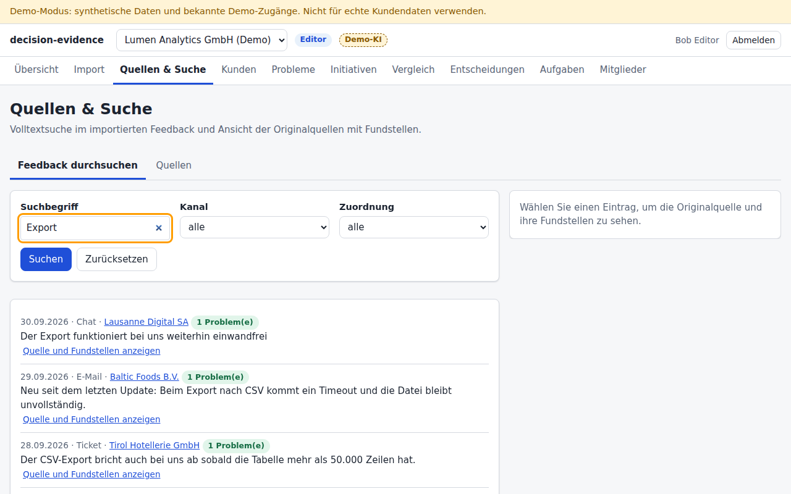

### Kunden & Opportunities

Zwei Reiter, **Kunden** und **Opportunities**, mit Suche. Umsatzwerte erscheinen mit Basis (ARR oder Jahresumsatz), Währung und Stand. Fehlt ein Wert, steht dort „unbekannt“.
Ein Klick auf einen Kunden zeigt rechts seine Opportunities, die Probleme, in denen er vorkommt, und seine letzten Aussagen.

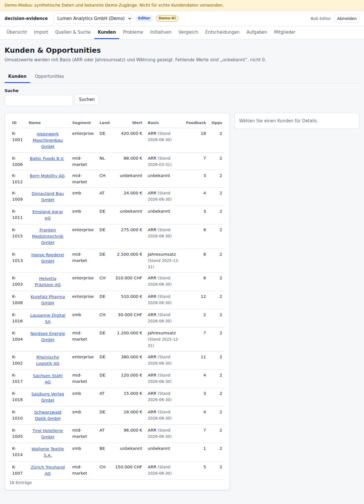

---

## 7. Analyse und Probleme

### Analyse starten

*Wer darf das? Editor, Admin und Owner.*

Auf der Seite **Probleme** starten Sie mit **Analyse starten** einen Hintergrundjob. Er betrachtet Feedback, das noch keinem Problem zugeordnet ist, und schlägt Problemcluster vor.
In einem neuen Workspace sehen Sie zunächst den Leerzustand:

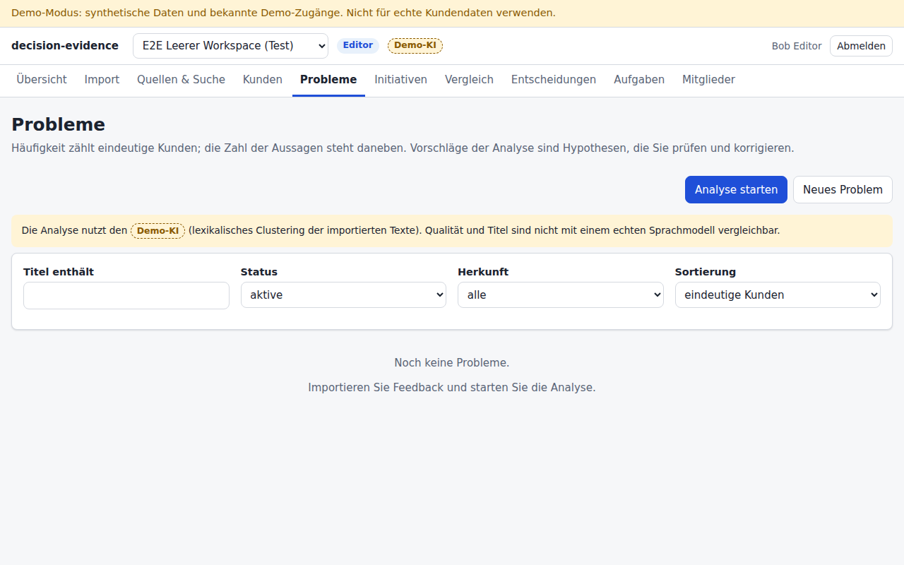

Der Job zeigt seinen Fortschritt. Sie müssen nicht warten, die Seite aktualisiert sich selbst.

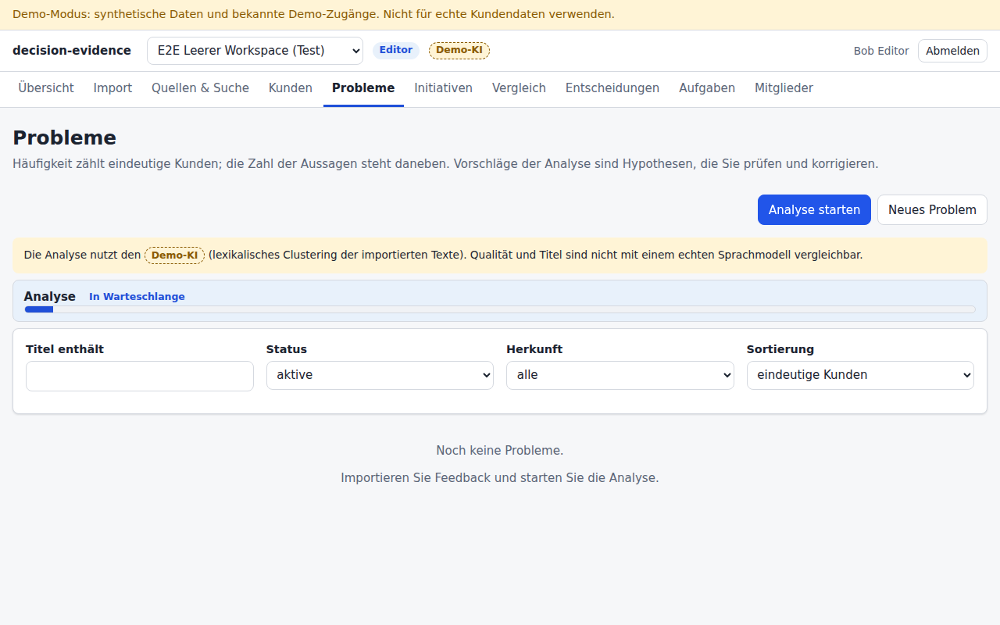

Die Analyse nutzt je nach Betrieb den **Demo-Adapter** (kennzeichnet sich mit „Demo-KI“), ein **Anthropic-Modell** oder ein **lokales Modell über Ollama**. Ein Hinweis über der Liste nennt den aktiven Anbieter.
Vorschläge werden serverseitig geprüft: Jede Quelle muss existieren und zu Ihrem Workspace gehören, jedes Zitat muss wörtlich im Text stehen. Alles andere wird verworfen und nie angezeigt.

### Die Problemliste

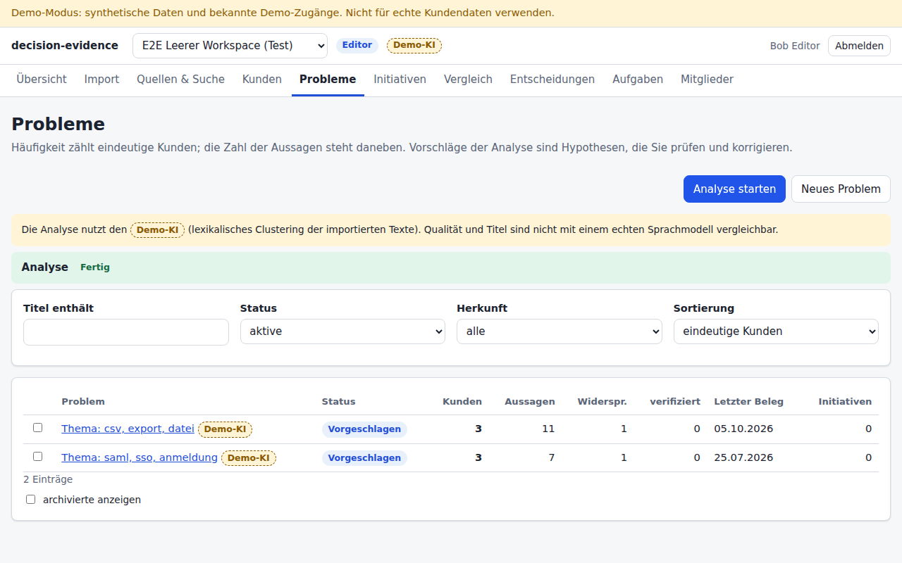

* **Filter:** Titel, Status (aktive, Vorgeschlagen, Bestätigt, Archiviert), Herkunft (alle, Analyse, manuell, abgespalten) und Sortierung (zum Beispiel nach eindeutigen Kunden).
* **Spalten:** *Kunden* (eindeutige Kunden, fett), *Aussagen* (Zahl der Aussagen), *Widerspr.* (widersprechende Aussagen), *verifiziert* (von Menschen geprüfte Belege), *Letzter Beleg* und *Initiativen*.
* **Neues Problem** legt ein Problem von Hand an. Mit den Kontrollkästchen markieren Sie Probleme zum **Zusammenführen** ([Kapitel 8](#8-belege-prüfen-und-probleme-korrigieren)).
* **archivierte anzeigen** blendet archivierte Probleme ein.

### Ein Problem ansehen

Ein Klick auf den Titel öffnet die Detailseite. Oben stehen Titel, Status, Herkunft (hier „Vorschlag der Analyse“) und die Beschreibung, daneben die Aktionen **Bestätigen**, **Archivieren**, **Bearbeiten** und **Initiative anlegen**.
Ein gelber Hinweis erinnert daran, dass ein Vorschlag ungeprüft ist. Vier Reiter gliedern die Seite: **Belege**, **Kennzahlen & Kontext**, **Verlauf**, **Initiativen**.

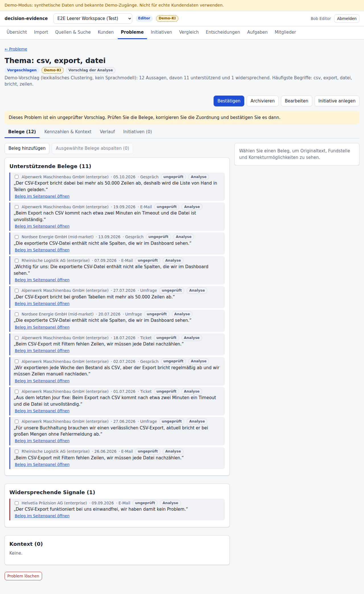

Die Belege sind in drei Gruppen geordnet: **Unterstützende Belege**, **Widersprechende Signale** (rot markiert) und **Kontext**. Jeder Beleg nennt Kunde und Segment, Datum, Kanal, ob er geprüft ist, und zeigt das Zitat.

### Kennzahlen & Kontext

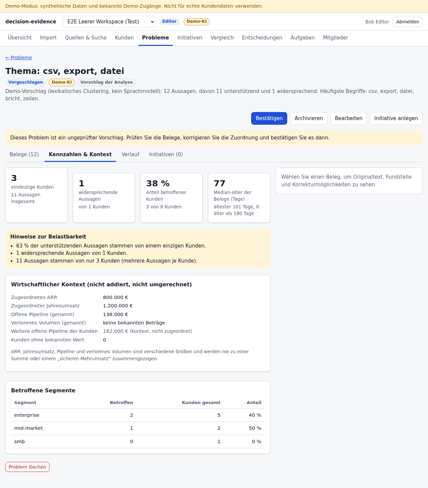

| Kachel / Block | Bedeutung |
|---|---|
| eindeutige Kunden | Wie viele **verschiedene** Kunden das Problem unterstützen. Darunter: Zahl der Aussagen |
| widersprechende Aussagen | Aussagen, die dem Problem widersprechen, und von wie vielen Kunden |
| Anteil betroffener Kunden | betroffene Kunden im Verhältnis zu allen Kunden des Workspaces |
| Median-Alter der Belege | in Tagen, mit ältestem Beleg und Zahl der Belege über der Aktualitätsgrenze |
| Hinweise zur Belastbarkeit | Warnungen, zum Beispiel wenn ein einzelner Kunde die Aussagen dominiert, wenn nur eine Minderheit der Kunden betroffen ist oder wenn Belege veraltet sind |
| Wirtschaftlicher Kontext | zugeordnetes ARR und Jahresumsatz, ausdrücklich zugeordnete offene Pipeline und verlorenes Volumen, weitere offene Pipeline der Kunden (nur Kontext), Kunden ohne bekannten Wert. **Nie addiert, nie umgerechnet** |
| Betroffene Segmente | wie viele Kunden je Segment betroffen sind |

Eine **laute Minderheit** ist kein Nachweis für den ganzen Markt. Deshalb nennt das Werkzeug neben jeder Häufigkeit die Abdeckung und warnt, wenn wenige Kunden viele Aussagen liefern.

---

## 8. Belege prüfen und Probleme korrigieren

*Wer darf das? Editor, Admin und Owner. Viewer können Belege ansehen.*

### Originalbeleg öffnen

Klicken Sie bei einem Beleg auf **Beleg im Seitenpanel öffnen**. Rechts erscheint der **Originalbeleg**: Kunde, Datum, Kanal, Quelle (mit Herkunft „Original“, „Importiert“ oder „Synthetisch“),
die **Fundstelle** (Datei und Zeile, Seite oder Absatz) und der Originaltext. Das Zitat ist darin hervorgehoben. Es steht wörtlich im Text, das hat der Server geprüft.

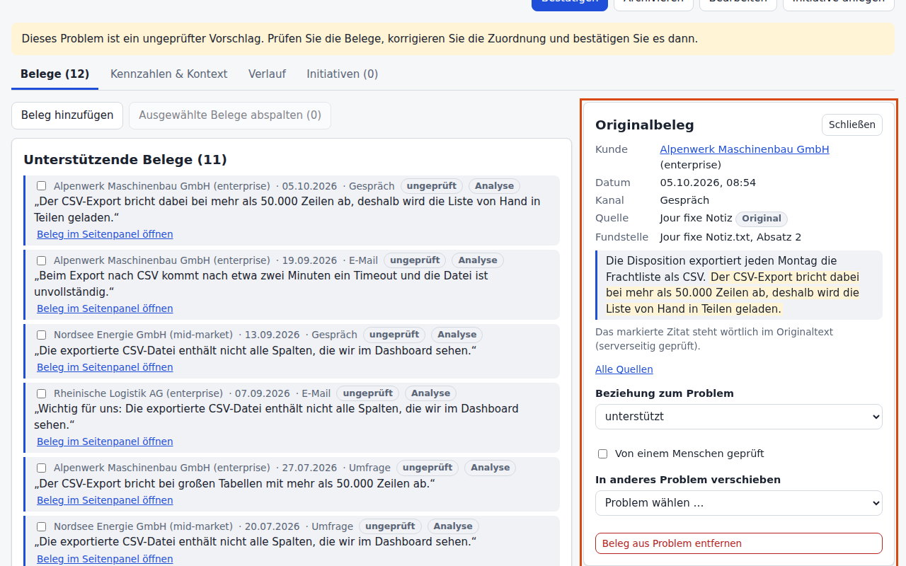

Im Seitenpanel können Sie außerdem:

* die **Beziehung zum Problem** ändern: unterstützend, widersprechend oder Kontext,
* den Beleg als **Von einem Menschen geprüft** markieren,
* den Beleg **in ein anderes Problem verschieben**,
* den Beleg **aus dem Problem entfernen** (die Quelle bleibt erhalten).

Mit **Beleg hinzufügen** suchen Sie im importierten Feedback, wählen die Beziehung (unterstützend, widersprechend, Kontext) und ergänzen einen Beleg von Hand.

### Probleme aufteilen

Markieren Sie die Belege, die nicht zum Problem gehören, mit den Kontrollkästchen und klicken Sie **Ausgewählte Belege abspalten**. Geben Sie dem neuen Problem einen Titel.

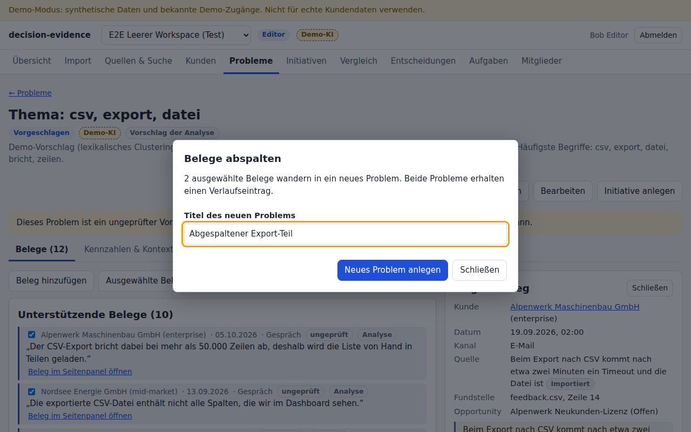

### Probleme zusammenführen

Markieren Sie in der Problemliste zwei oder mehr Probleme und klicken Sie **Zusammenführen**. Das **zuerst** markierte Problem bleibt bestehen und nimmt die Belege der anderen auf.

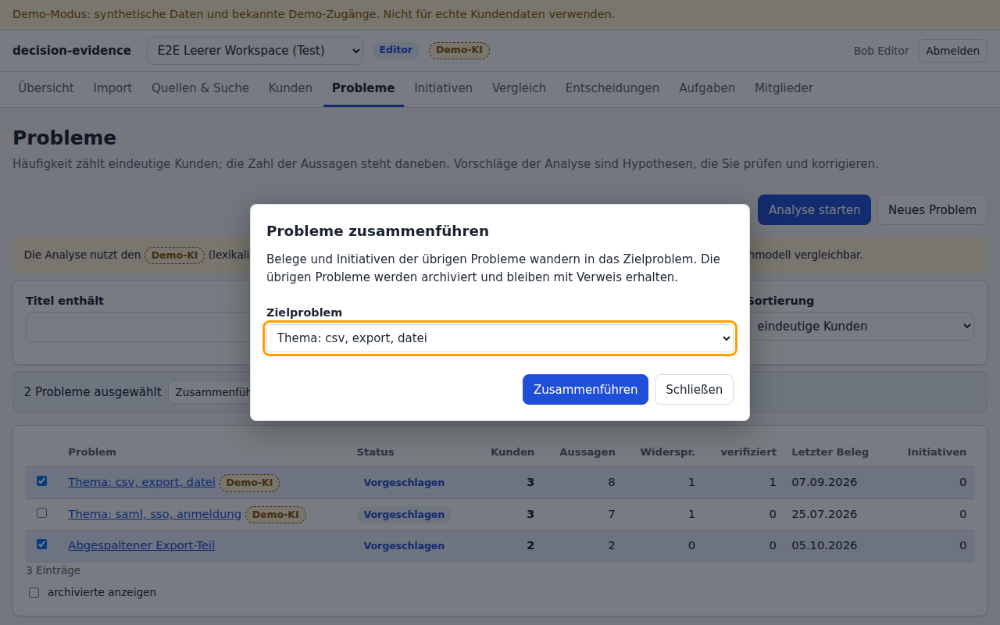

### Verlauf

Jede Korrektur wird nachvollziehbar festgehalten und lässt sich nicht nachträglich ändern: Zusammenführungen, Abspaltungen, Änderungen der Beziehung, verschobene Belege.

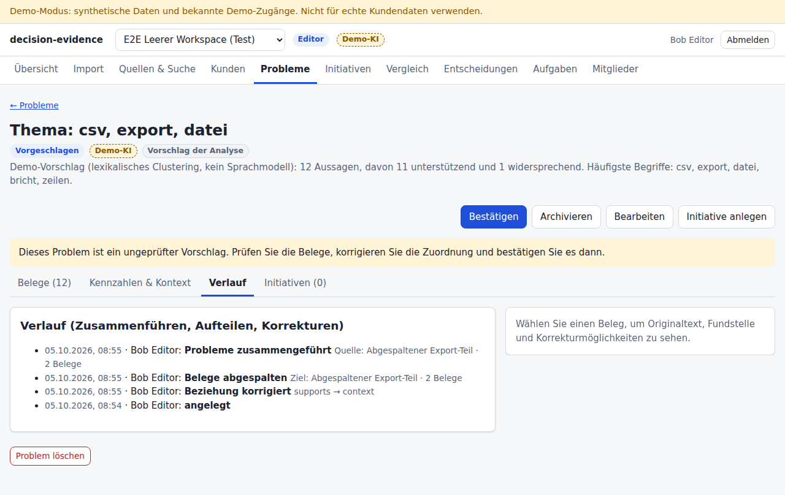

### Bearbeiten und bestätigen

**Bearbeiten** ändert Titel, Beschreibung und die verantwortliche Person.

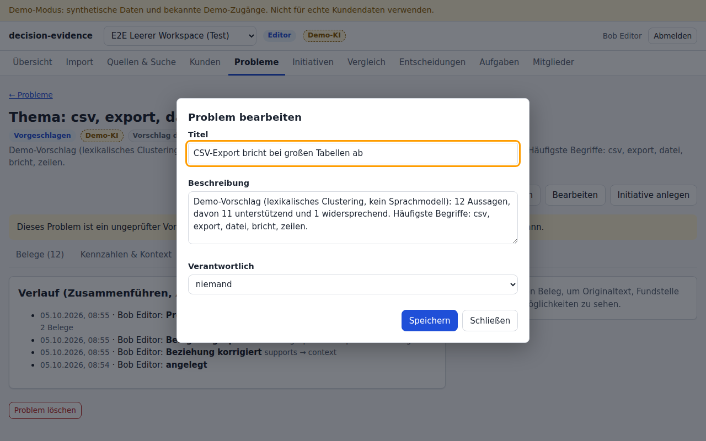

Mit **Bestätigen** erklären Sie ein geprüftes Problem zur Grundlage für Initiativen. Der Status wechselt auf „Bestätigt“. Ein bestätigtes Problem lässt sich nicht löschen, nur archivieren.

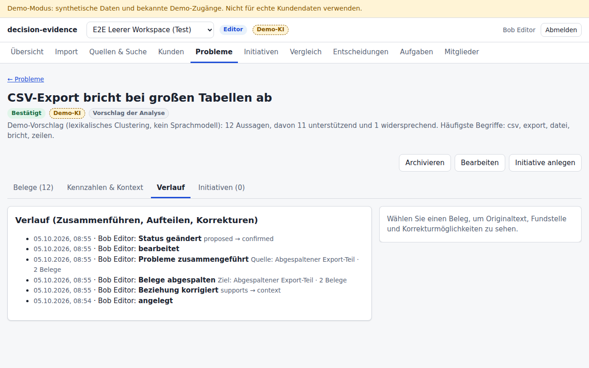

Mehrere Personen können gleichzeitig arbeiten. Hat jemand das Problem zwischenzeitlich geändert, meldet die Oberfläche einen Konflikt, statt fremde Änderungen zu überschreiben. Laden Sie die Seite neu und wiederholen Sie die Änderung.

---

## 9. Initiativen und Annahmen

*Wer darf das? Editor, Admin und Owner.*

Eine **Initiative** beantwortet ein Problem. Sie legen sie auf der Detailseite eines Problems mit **Initiative anlegen** an.

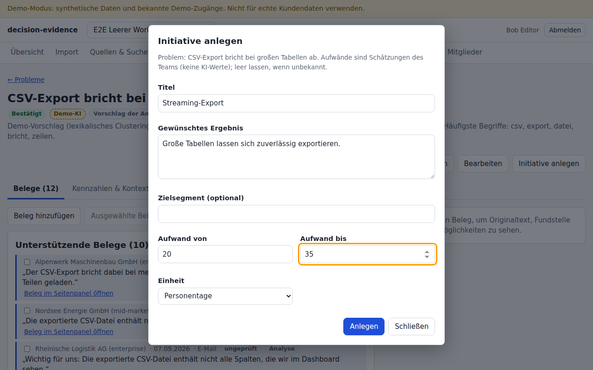

| Feld | Bedeutung |
|---|---|
| Titel | Name der Initiative |
| Gewünschtes Ergebnis | was sich ändern soll |
| Zielsegment (optional) | zum Beispiel enterprise oder smb |
| Aufwand von / bis | **Ihre Schätzung** als Spanne. Das Werkzeug und die KI schätzen keinen Aufwand |
| Einheit | Personentage oder andere Einheiten |

Auf der Seite **Initiativen** sehen Sie alle Initiativen mit Problem, Status und Score.

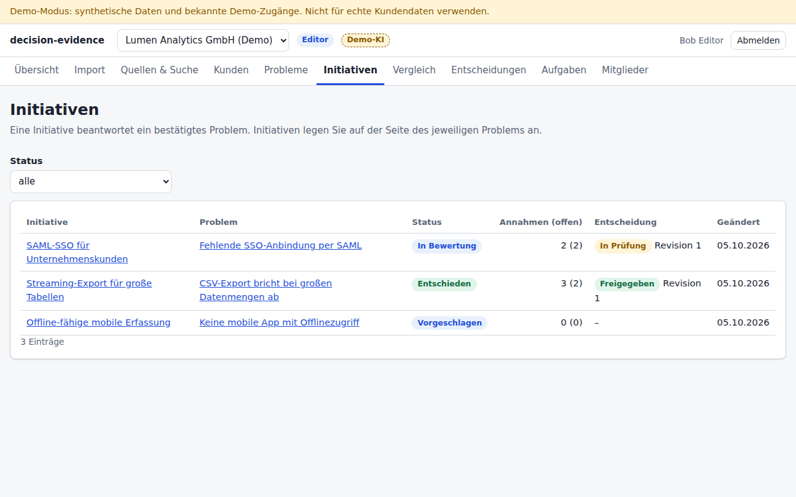

### Annahmen

Annahmen machen sichtbar, worauf eine Initiative beruht. Mit **Annahme hinzufügen** erfassen Sie eine Aussage und ihre Art:

* **beobachtet:** mit Quelle belegt. Hier ist die Angabe eines Belegs aus dem Problem Pflicht (Feld „Quelle“).
* **Schätzung:** eine begründete Annahme des Teams.
* **Hypothese:** eine Vermutung, die erst zu prüfen ist.

Für jede Annahme führen Sie einen Prüfstatus (zum Beispiel „offen“).

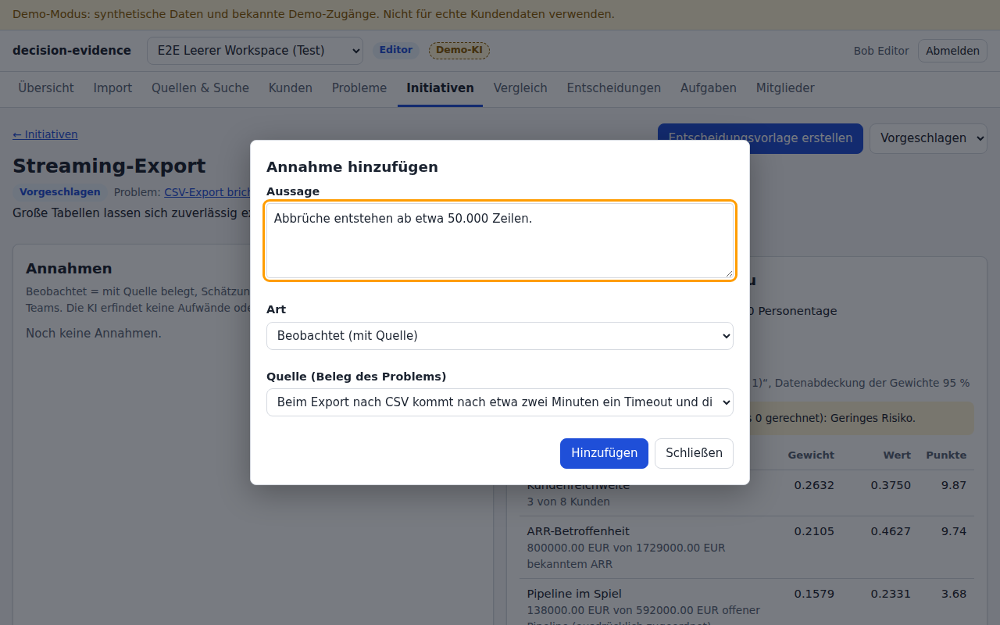

### Aufwand und Score-Vorschau

Rechts sehen Sie Ihre Aufwandsschätzung und die **Score-Vorschau** nach der aktiven Scoring-Policy: je Kriterium Gewicht, Wert und Punkte, dazu die Datenabdeckung der Gewichte.
Kriterien, für die Werte fehlen (hier das Risiko, das Menschen einschätzen), werden ausdrücklich genannt und nicht als 0 gerechnet ([Kapitel 11](#11-vergleich-und-scoring)).
Unten stehen der Problemkontext und der Link **Mit anderen Initiativen vergleichen**.

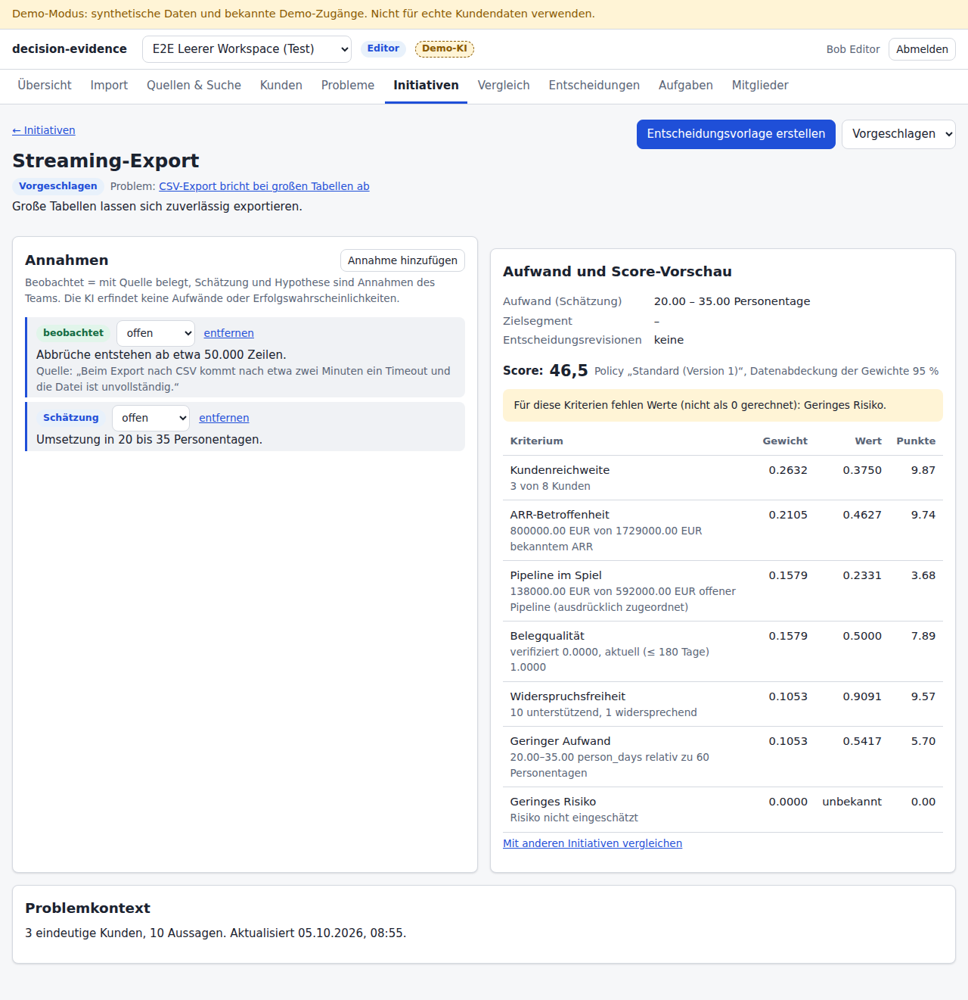

Von hier aus erstellen Sie mit **Entscheidungsvorlage erstellen** den Entscheidungsentwurf.

---

## 10. Entscheidungsvorlage, Freigabe und Export

### Optionen erfassen

*Wer darf das? Entwürfe erstellen und bearbeiten: Editor, Admin, Owner.*

Eine Entscheidungsvorlage vergleicht Handlungsoptionen. Tragen Sie einen **Titel** und die **Optionen** A und B ein. Mit **Option hinzufügen** ergänzen Sie weitere.

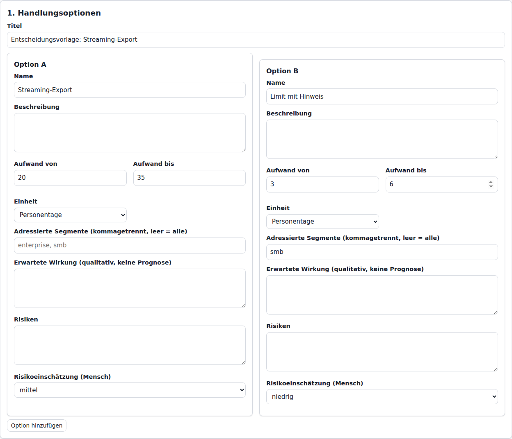

Je Option erfassen Sie Name, Beschreibung, **Aufwand von/bis** mit Einheit, adressierte Segmente (leer bedeutet alle), die erwartete Wirkung (qualitativ, **keine Prognose**), Risiken und Ihre **Risikoeinschätzung** (niedrig, mittel, hoch).

Unter **3. Begründung des Teams** schreiben Sie, was Sie empfehlen und warum. Das ist Ihre Entscheidungsgrundlage, nicht die der KI.

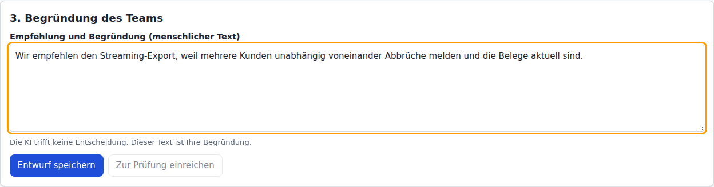

Mit **Entwurf speichern** sichern Sie den Stand.

### Belegstand einfrieren und Scoring

Mit **Belegstand einfrieren** hält das Werkzeug den heutigen Wissensstand fest: die belegenden Zitate, die Kennzahlen und das Scoring der Optionen. Danach erscheint der **Score-Vergleich der Optionen**:
Ranking, je Kriterium Wert und Punkte, Datenabdeckung und die Aussage, ob die Rangfolge bei ±25 % Gewichtsänderung stabil bleibt.

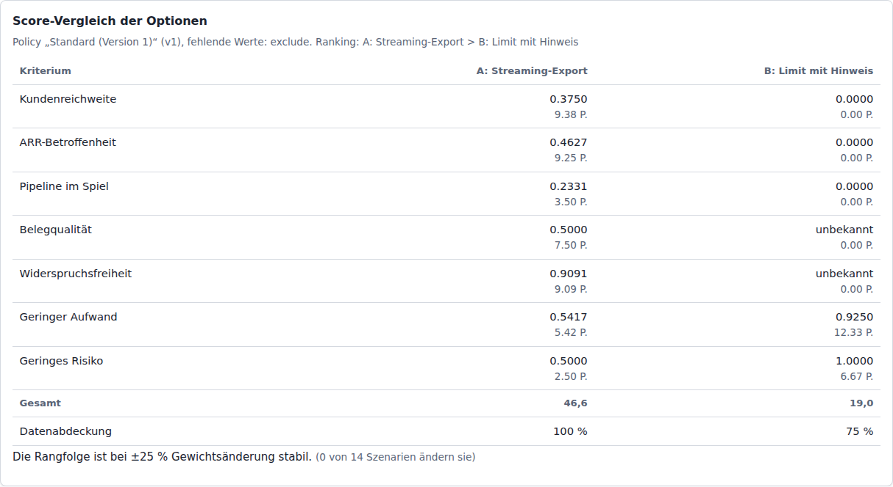

Ohne eingefrorenen Belegstand lässt sich die Vorlage nicht einreichen. Später können Sie den Belegstand mit **Belegstand aktualisieren** erneuern, solange die Vorlage ein Entwurf ist.

### KI-Entwurf zur Begründung (optional)

**KI-Entwurf anfordern** erzeugt im Hintergrund einen Textvorschlag. Er fasst nur zusammen, was die Belege und berechneten Kennzahlen hergeben, und nennt offene Fragen und Grenzen.

* Jede Behauptung trägt Verweise auf Belege oder berechnete Ergebnisse. Behauptungen ohne gültigen Beleg werden verworfen. Die Zeile „Geprüft: … übernommen, … verworfen“ zeigt das.
* Zahlen stammen aus der Berechnung, nicht aus dem Modell.
* Die KI gibt keine Empfehlung für eine Option und schätzt weder Aufwand noch Erfolgswahrscheinlichkeit.
* Der Entwurf ist als KI-Ergebnis gekennzeichnet, im Demo als „Demo-Entwurf“.

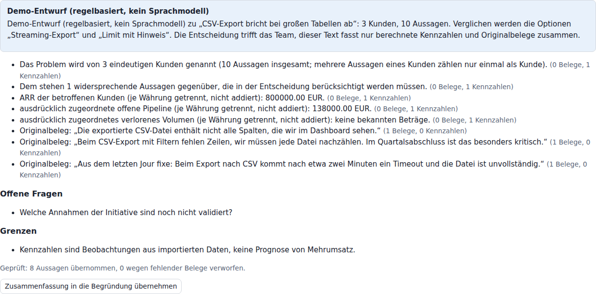

### Einreichen und kommentieren

Mit **Zur Prüfung einreichen** wechselt die Vorlage auf „In Prüfung“. Sie ist danach nicht mehr zu bearbeiten. Hat sie ungespeicherte Änderungen oder keinen Belegstand, ist die Schaltfläche gesperrt und nennt den Grund.
Kommentare sind jederzeit möglich, auch nach der Freigabe.

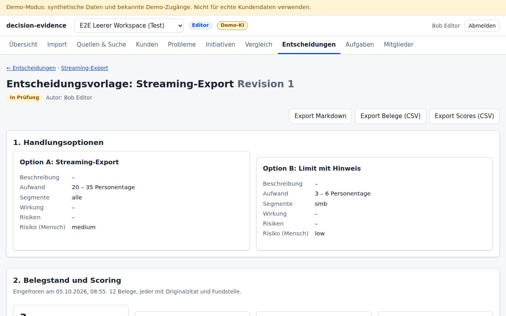


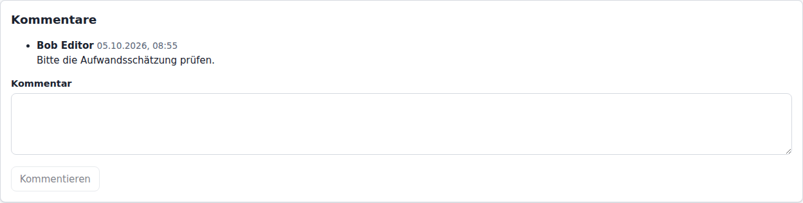

### Freigeben

*Wer darf das? Admin und Owner, und nicht die Person, die eingereicht hat (Vier-Augen-Prinzip).*

Eine zweite Person öffnet die Vorlage und prüft Optionen, Belegstand, Scoring und Begründung. Dann entscheidet sie:

* **Freigeben:** erzeugt eine **unveränderliche Revision**. Alles in ihr, auch der Belegstand zum Zeitpunkt der Freigabe, ist von da an gesperrt.
* **Änderungen anfordern:** schickt die Vorlage zurück in den Entwurf.

Ist die Schaltfläche gesperrt, steht der Grund daneben („Vier-Augen-Prinzip: Autorin oder Autor dürfen nicht selbst freigeben.“). Admins und Owner können in den Einstellungen die **Selbstfreigabe** erlauben. Das hebt das Vier-Augen-Prinzip auf und gehört nur in begründete Ausnahmefälle.

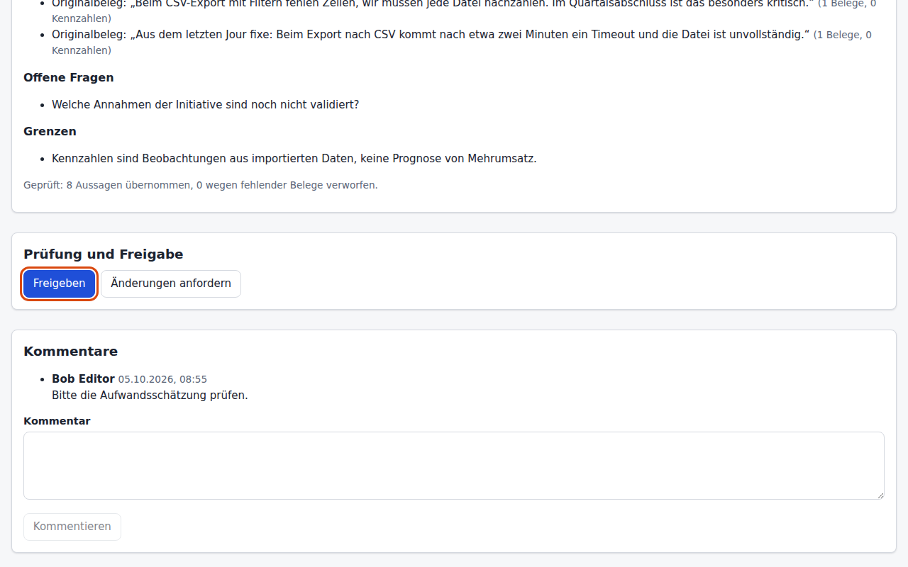

Nach der Freigabe zeigt die Seite „Freigegeben von … am …“, die Hinweisbox „freigegeben und unveränderlich“ und die Exportschaltflächen.

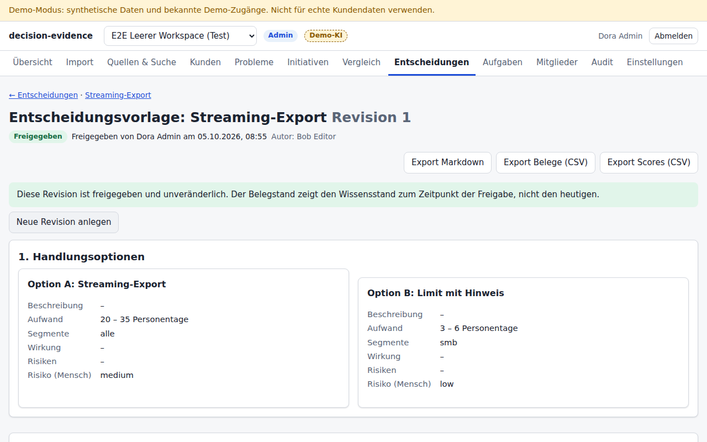

Im Abschnitt **Revisionen** sehen Sie alle Revisionen dieser Initiative und welche gerade geöffnet ist.


### Exportieren

*Wer darf das? Alle Rollen.*

Drei Schaltflächen oben auf der Seite:

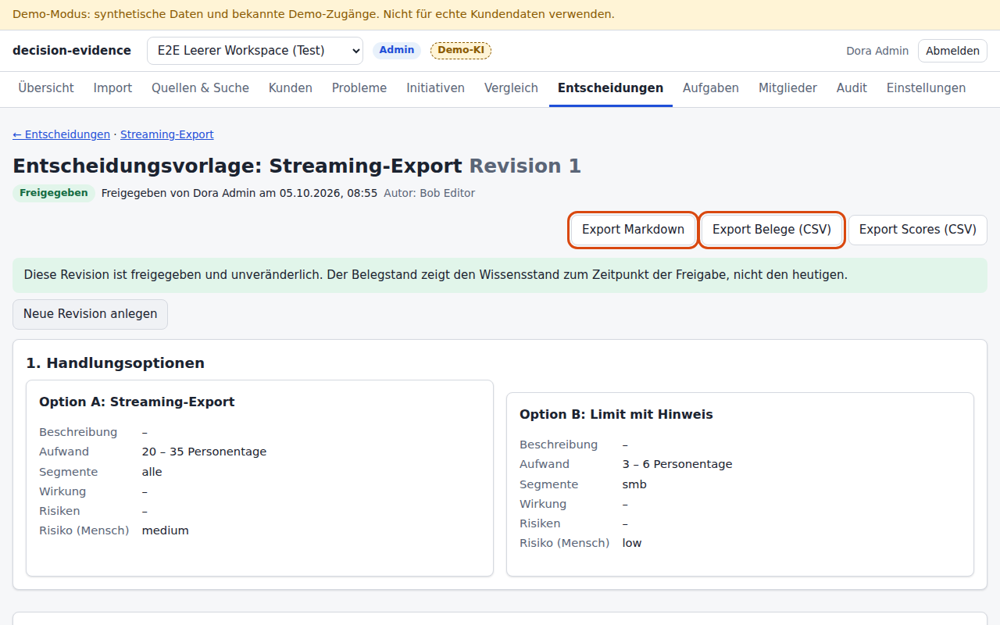

| Export | Inhalt |
|---|---|
| **Export Markdown** | die Entscheidungsvorlage als Text: Optionen, Begründung, Kennzahlen, Zitate mit Quelle, Hinweis „keine Roadmap-Zusage“ |
| **Export Belege (CSV)** | jede zitierte Belegstelle mit Beziehung, Kunde, Datum, Kanal und Zitat |
| **Export Scores (CSV)** | das Scoring je Option und Kriterium |

Die Exporte enthalten die tatsächlich gespeicherten Daten. CSV-Zellen, die mit `=`, `+`, `-`, `@` beginnen, werden entschärft, damit Tabellenprogramme keine Formeln ausführen. Jeder Export steht im Audit-Protokoll.

### Neue Erkenntnisse: Änderung seit der Freigabe und neue Revision

Eine Freigabe hält eine **historische Entscheidung** fest. Kommen später neue Belege dazu, bleibt die Revision unverändert. Das Werkzeug zeigt den neuen Stand getrennt davon:

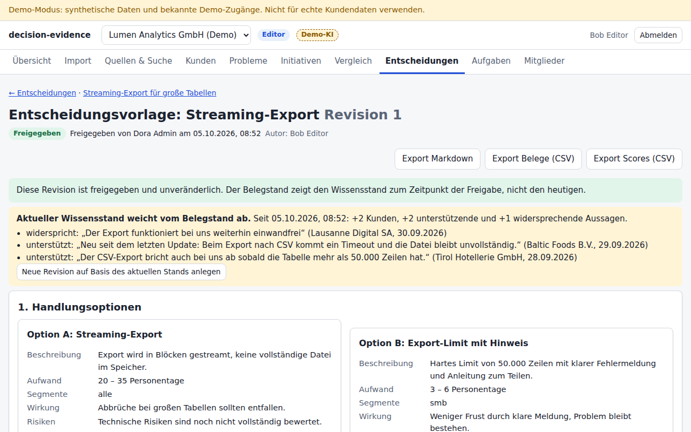

Der Hinweis nennt die Änderung seit dem Belegstand (hier: mehr Kunden, zusätzliche unterstützende und widersprechende Aussagen) und listet die neuen Belege:

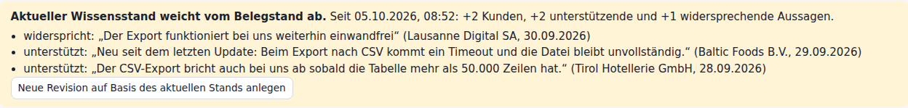

Mit **Neue Revision auf Basis des aktuellen Stands anlegen** beginnen Sie eine neue Version, die wieder den Weg Entwurf, Prüfung, Freigabe durchläuft. Die frühere Revision wird mit der Freigabe der neuen **abgelöst**, bleibt aber lesbar.

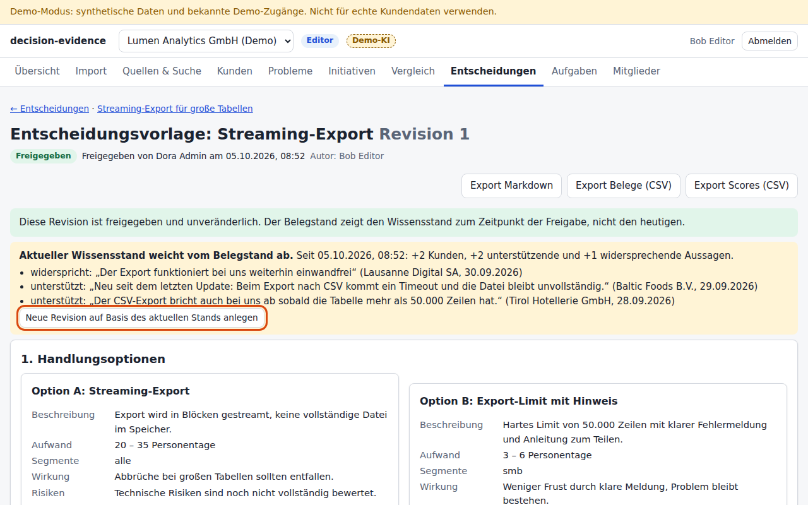

### Alle Entscheidungen

Die Seite **Entscheidungen** listet alle Vorlagen mit Revision, Zustand und Autor.

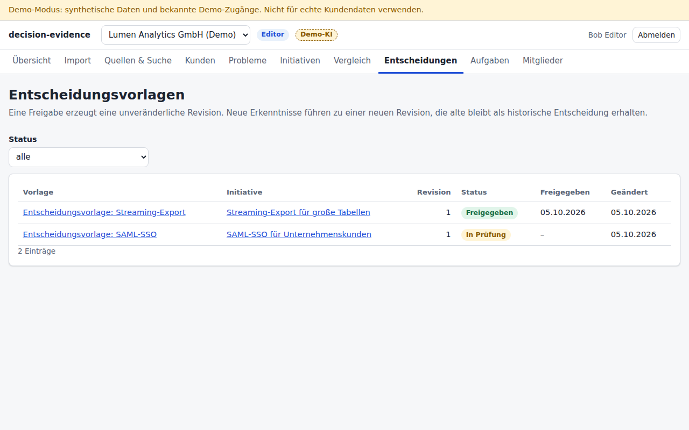

---

## 11. Vergleich und Scoring

*Wer darf das? Alle Rollen können vergleichen. Neue Policies legen Admins und Owner über die Schnittstelle an.*

Die Seite **Vergleich** stellt mehrere Initiativen gegenüber. Das Scoring ist **transparent, deterministisch und veränderbar**: gleiche Eingaben ergeben immer dasselbe Ergebnis. Es kommt keine KI darin vor.

Wählen Sie die Initiativen aus, prüfen oder ändern Sie die **Gewichte** und klicken Sie **Vergleich berechnen**. Die Gewichte müssen sich zu 1 summieren, die Oberfläche zeigt die Summe laufend.

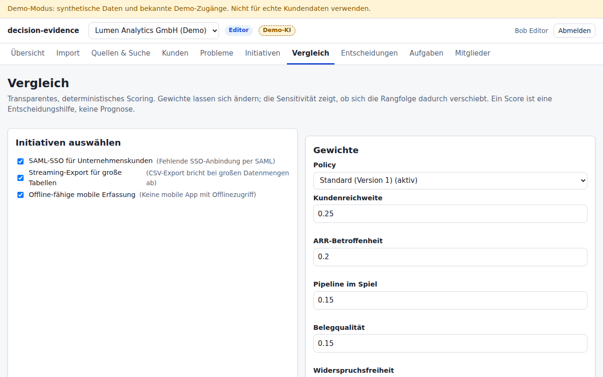

### Die sieben Kriterien

| Kriterium | Woher der Wert kommt |
|---|---|
| Kundenreichweite | Anteil der betroffenen Kunden |
| ARR-Betroffenheit | Anteil am bekannten ARR (in der Währung der Policy) |
| Pipeline im Spiel | Anteil an der offenen Pipeline der Policy-Währung |
| Belegqualität | Anteil verifizierter und aktueller Belege |
| Widerspruchsfreiheit | Anteil unterstützender Aussagen |
| Geringer Aufwand | Ihre Aufwandsschätzung relativ zu einer Referenz |
| Geringes Risiko | Ihre Risikoeinschätzung (Mensch) |

Der Score ist `100 × Σ (Gewicht × Wert)` über die Kriterien mit bekanntem Wert. Ist ein Wert unbekannt, richtet sich das Ergebnis nach der Policy: **exclude** (Gewichte der bekannten Kriterien werden neu verteilt, die Datenabdeckung wird ausgewiesen), **zero** (bewusst schlechter) oder **block** (kein Ergebnis, bis die Lücke geschlossen ist).
Die Standard-Policy verwendet „exclude“. Ein Score ist eine Entscheidungshilfe, keine Prognose.

### Ergebnis, Sensitivität und Gesamtbetrachtung

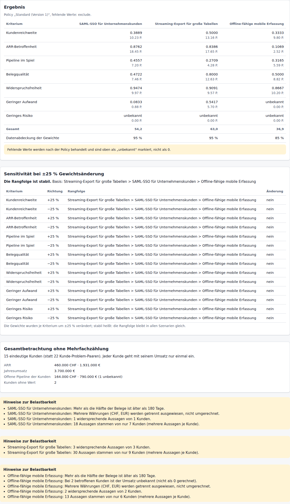

* **Ergebnis:** je Kriterium Wert und Punkte, „unbekannt“ wo Werte fehlen, Gesamtscore und Datenabdeckung der Gewichte.
* **Sensitivität bei ±25 % Gewichtsänderung:** Das Werkzeug verändert jedes Gewicht um 25 % nach oben und unten und prüft, ob sich die Rangfolge ändert. „Die Rangfolge ist stabil“ heißt: in keinem der Szenarien ändert sich die Reihenfolge. Andernfalls sehen Sie, welche Annahme sie kippt.
* **Gesamtbetrachtung ohne Mehrfachzählung:** Ein Kunde, der in mehreren Problemen vorkommt, geht mit seinem Umsatz nur **einmal** ein. Das Werkzeug nennt die Zahl der eindeutigen Kunden im Vergleich zu den Kunde-Problem-Paaren.
* **Hinweise zur Belastbarkeit** je Initiative (veraltete Belege, mehrere Währungen, unbekannte Werte, widersprechende Aussagen).

---

## 12. Aufgaben im Hintergrund

Importe, Analysen und KI-Entwürfe laufen im Hintergrund. Die Seite **Aufgaben** zeigt sie mit Art, Status (In Warteschlange, Läuft, Fertig, Fehlgeschlagen), Fortschritt, Versuchen und Zeitpunkt.

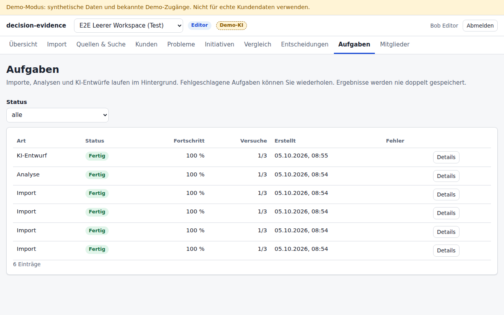

* **Details** zeigt Fehlermeldung und technischen Code.
* Eine **fehlgeschlagene** Aufgabe können Sie mit **Erneut versuchen** neu starten. Ergebnisse werden dabei nie doppelt gespeichert.
* Kurzzeitige Störungen (zum Beispiel ein nicht erreichbarer KI-Dienst) werden automatisch mit Wartezeit wiederholt. Erst nach dem letzten Versuch erscheint „Fehlgeschlagen“.
* Eine Aufgabe, die auf einen ausgefallenen Dienst wartet, geht nicht verloren: Sie wird nachgeholt, sobald der Dienst wieder da ist.
* Pro Workspace laufen höchstens so viele Aufgaben gleichzeitig, wie die Einstellungen erlauben (Standard 3).

---

## 13. Mitglieder, Einstellungen und Audit

*Wer darf das? Admin und Owner.*

### Mitglieder

Die Seite **Mitglieder** zeigt alle Personen des Workspaces mit Rolle, Status und letzter Anmeldung.

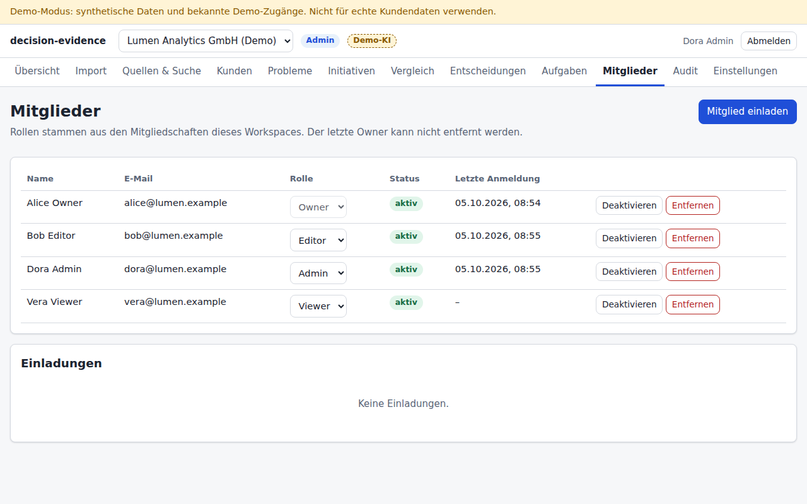

* **Rolle ändern:** über die Auswahlliste in der Zeile. Die Rolle Owner können nur Owner vergeben oder ändern.
* **Deaktivieren / Aktivieren:** sperrt den Zugang, ohne die Person zu löschen. Wirkt sofort.
* **Entfernen:** nimmt die Person aus dem Workspace.
* Der **letzte aktive Owner** kann weder entfernt noch herabgestuft werden.

### Mitglied einladen

Klicken Sie **Mitglied einladen**, geben Sie die E-Mail-Adresse und die Rolle ein.

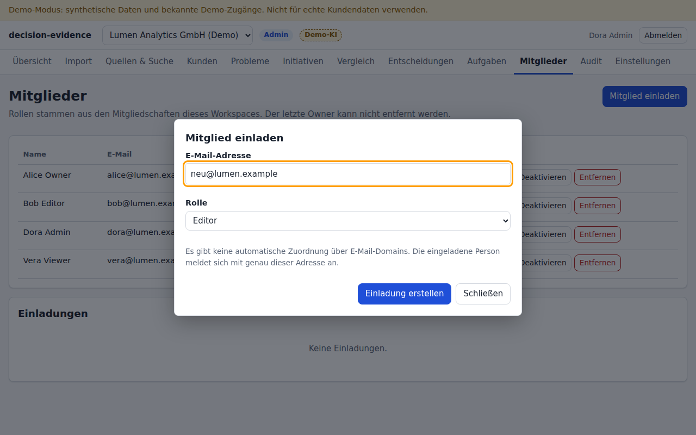

Das Werkzeug erzeugt einen **Einladungslink**. Er wird **nur jetzt angezeigt** (später nicht mehr abrufbar), ist sieben Tage gültig, funktioniert einmal und ist an genau diese E-Mail-Adresse gebunden.
Es wird keine E-Mail verschickt: Geben Sie den Link selbst weiter. Es gibt keine automatische Zuordnung über E-Mail-Domains.

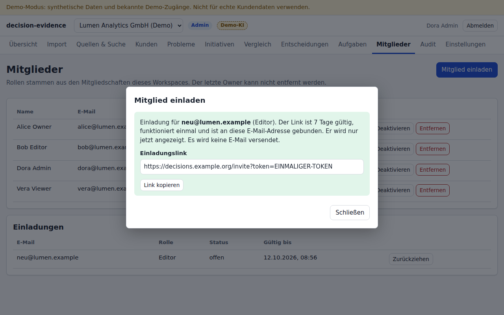

Offene Einladungen stehen unter **Einladungen** und lassen sich mit **Zurückziehen** widerrufen.

### Einstellungen

Auf der Seite **Einstellungen** legen Sie die Grenzen und Regeln des Workspaces fest.

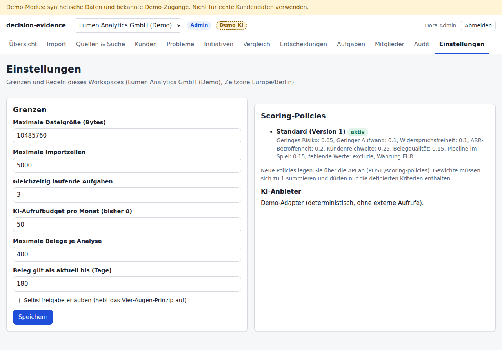

| Einstellung | Bedeutung |
|---|---|
| Maximale Dateigröße | größter erlaubter Upload in Bytes |
| Maximale Importzeilen | größte Zeilenzahl je Import |
| Gleichzeitig laufende Aufgaben | wie viele Hintergrundaufgaben parallel laufen dürfen |
| KI-Aufrufbudget pro Monat | wie viele KI-Aufrufe der Workspace im Monat auslösen darf (die Zahl der bisherigen Aufrufe steht dabei). Ist es erschöpft, werden neue Analysen abgelehnt |
| Maximale Belege je Analyse | wie viele Textstellen höchstens an die KI gehen |
| Beleg gilt als aktuell bis (Tage) | Grenze für „veraltet“ in Kennzahlen und Hinweisen |
| Selbstfreigabe erlauben | hebt das Vier-Augen-Prinzip auf |

Rechts sehen Sie die **Scoring-Policies** mit ihren Gewichten und die Angabe zum **KI-Anbieter**: Demo-Adapter, Anthropic oder ein lokales Ollama-Modell.
Eine neue Policy legen Admins über die Schnittstelle an (`POST /scoring-policies`). Es gibt dafür bisher keine Eingabemaske.

### Audit-Protokoll

Das Audit-Protokoll listet Mitgliedschaften, Änderungen, Freigaben und Exporte mit Zeitpunkt, Person und Aktion. Es ist nur anhängbar: Einträge lassen sich weder ändern noch löschen.

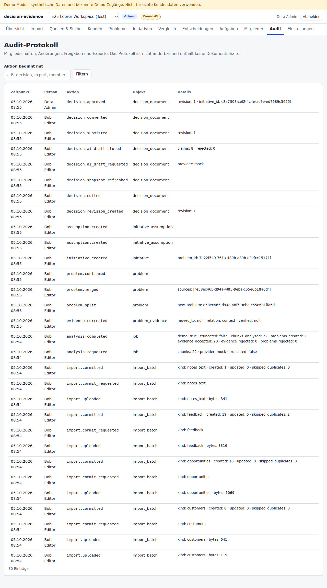

---

## 14. Rollen und Berechtigungen

Jede Person hat in jedem Workspace genau eine Rolle. Die Rolle gilt nur dort. Berechtigungen werden vom Server geprüft, nicht nur in der Oberfläche. Eine ausgeblendete Schaltfläche ist also nicht der einzige Schutz.

| Aktion | Viewer | Editor | Admin | Owner |
|---|:---:|:---:|:---:|:---:|
| Übersicht, Probleme, Belege, Initiativen, Entscheidungen ansehen | ja | ja | ja | ja |
| Suchen, Vergleichen, Exportieren | ja | ja | ja | ja |
| Importieren | nein | ja | ja | ja |
| Analyse starten, fehlgeschlagene Aufgaben wiederholen | nein | ja | ja | ja |
| Probleme und Belege bearbeiten, zusammenführen, aufteilen | nein | ja | ja | ja |
| Initiativen, Annahmen, Entscheidungsentwürfe, Kommentare | nein | ja | ja | ja |
| Zur Prüfung einreichen | nein | ja | ja | ja |
| Freigeben, Änderungen anfordern | nein | nein | ja | ja |
| Mitglieder, Einladungen, Einstellungen, Audit, Quellen löschen | nein | nein | ja | ja |
| Rolle Owner vergeben | nein | nein | nein | ja |

Fehlt Ihnen eine Berechtigung, weist die Seite darauf hin. Hier die Importseite für die Rolle Viewer:

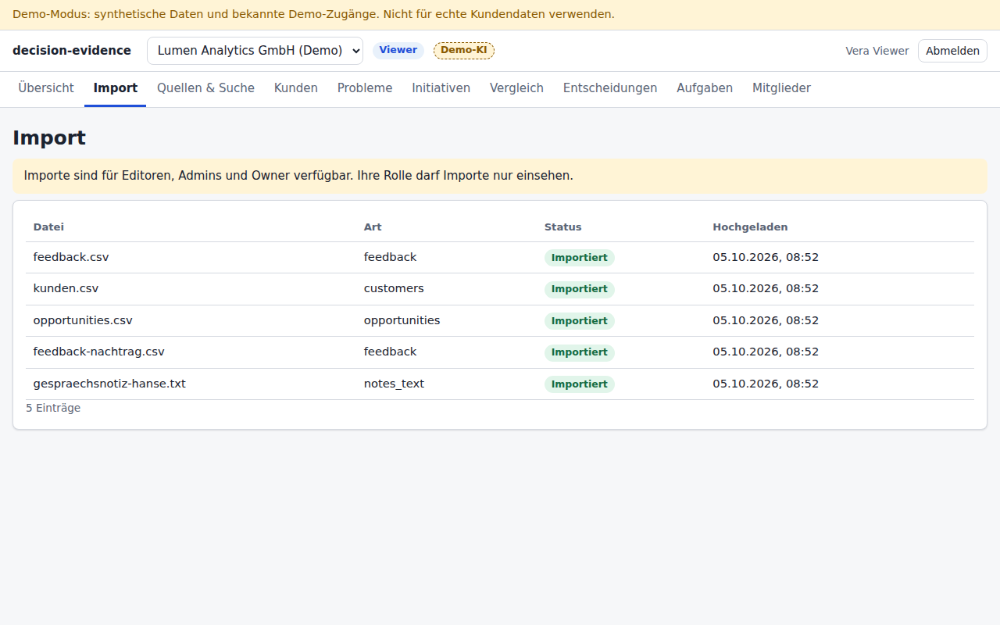

---

## 15. Begriffe, Rechenregeln und häufige Fragen

### Begriffe

| Begriff | Bedeutung |
|---|---|
| Workspace | abgeschlossener Datenbereich einer Organisation |
| Quelle | ein importierter Inhalt: Datei, Feedbackzeile oder Notiz |
| Fundstelle | die genaue Stelle in der Quelle (Zeile, Seite, Absatz) |
| Aussage / Feedbackeintrag | eine Kundenäußerung, optional einem Kunden und einer Opportunity zugeordnet |
| Beleg | die Verbindung einer Aussage mit einem Problem samt wörtlichem Zitat und Beziehung |
| Beziehung | unterstützend, widersprechend oder Kontext |
| Problem | ein wiederkehrendes Kundenproblem, das durch Belege gestützt wird |
| Initiative | eine mögliche Antwort auf ein bestätigtes Problem |
| Annahme | eine Voraussetzung der Initiative: beobachtet, Schätzung oder Hypothese |
| Revision | eine Version einer Entscheidungsvorlage. Freigegebene Revisionen sind unveränderlich |
| Belegstand (Snapshot) | der eingefrorene Wissensstand einer Revision |
| ARR | wiederkehrender Jahresumsatz eines Kunden |
| Jahresumsatz | Umsatz eines Kunden pro Jahr, **nicht** dasselbe wie ARR |
| Pipeline | Betrag offener Verkaufschancen |
| Verlorenes Volumen | Betrag verlorener Verkaufschancen |
| unbekannt | der Wert fehlt. Er wird nie als 0 gerechnet |

### Rechenregeln, auf die Sie sich verlassen können

* **Eindeutige Kunden:** Häufigkeit zählt verschiedene Kunden. Aussagen ohne Kundenzuordnung zählen nicht als Kunden.
* **Getrennte Beträge:** ARR, Jahresumsatz, offene Pipeline und verlorenes Volumen werden nie addiert und nie als „sicherer Mehrumsatz“ bezeichnet.
* **Währungen:** Nie umgerechnet. Bei mehreren Währungen stehen die Summen nebeneinander.
* **Zuordnung der Pipeline:** Als zugeordnet gilt nur, was ein unterstützender Beleg ausdrücklich nennt. Die übrige offene Pipeline der betroffenen Kunden steht als Kontext daneben.
* **Keine Mehrfachzählung:** In Gesamtbetrachtungen geht ein Kunde nur einmal mit seinem Umsatz ein, auch wenn er in mehreren Problemen vorkommt.
* **Aktualität und Abdeckung:** Das Alter der Belege und der Anteil betroffener Kunden stehen bei jeder Kennzahl.

### Häufige Fragen

**Warum kann ich einen Import nicht bestätigen?** Die Vorschau meldet Fehler (rote Markierung) oder die Datei wurde schon importiert. Korrigieren Sie die Datei und laden Sie sie neu hoch.

**Warum steht bei einem Betrag „unbekannt“?** In den Daten fehlt der Wert. Das Werkzeug rechnet ihn nie als 0. Ergänzen Sie ihn in den Stammdaten und importieren Sie mit „vorhandene Datensätze aktualisieren“.

**Warum ist „Zur Prüfung einreichen“ gesperrt?** Es fehlt der Belegstand („Belegstand einfrieren“) oder es gibt ungespeicherte Änderungen („Entwurf speichern“).

**Warum kann ich meine eigene Vorlage nicht freigeben?** Das Vier-Augen-Prinzip verlangt eine zweite Person. Ein Admin kann die Selbstfreigabe in den Einstellungen erlauben.

**Eine freigegebene Vorlage ist veraltet. Was tun?** Legen Sie eine neue Revision an. Die alte bleibt als historische Entscheidung erhalten.

**Die KI hat ein Problem vorgeschlagen, das nicht stimmt.** Archivieren oder löschen Sie es, oder teilen Sie es auf. Vorschläge sind Hypothesen. Nur bestätigte Probleme führen zu Initiativen.

**Eine Aufgabe ist fehlgeschlagen.** Öffnen Sie **Aufgaben**, lesen Sie die Meldung unter **Details** und wiederholen Sie die Aufgabe. Bei einem lokalen Modell bedeutet `ai_model_missing`, dass das Modell auf dem Ollama-Server fehlt ([Betrieb](../operations/ollama.md)).

**„KI-Aufrufbudget erschöpft“.** Ein Admin kann das Monatsbudget in den Einstellungen erhöhen.

**Meine Sitzung ist abgelaufen.** Melden Sie sich neu an. Nicht gespeicherte Eingaben in Formularen können verloren gehen.

**Wer sieht meine Daten?** Nur Mitglieder Ihres Workspaces, nach ihrer Rolle. Andere Workspaces sehen sie nicht. Zur KI gehen nur Textstellen, keine Kundennamen und keine Beträge ([KI-Datenfluss](../architecture/ai-dataflow.md)).

### Was das Werkzeug nicht tut

* Es trifft keine Entscheidungen und gibt keine Roadmap-Zusagen.
* Es schreibt nicht in Ihr CRM und hat keine Anbindung an Ticketsysteme. Daten kommen per Upload.
* Es prognostiziert keinen Mehrumsatz und keine Erfolgswahrscheinlichkeiten.
* Es verschickt keine E-Mails (Einladungen sind Links).
* Es führt keine Texterkennung (OCR) für Scans durch.

---

## 16. Screenshots neu erstellen

Die Bilder in `bilder/` entstehen aus der laufenden Anwendung mit echten Anmeldungen. Wenn sich die Oberfläche ändert, erzeugen Sie sie neu:

```sh
# frischen Teststack starten (leeres Projekt, eigene Volumes, Port 8481)
export COMPOSE_PROJECT_NAME=de-test-docs APP_ENV=test APP_PORT=8481
docker compose -f compose.yaml -f compose.test.yaml up -d --build --wait

# Bilder aufnehmen (überschreibt docs/benutzerhandbuch/bilder)
cd tests/e2e && pnpm install --frozen-lockfile
E2E_BASE_URL=http://localhost:8481 pnpm exec playwright test -c playwright.screenshots.config.ts

# aufräumen (nur dieses Testprojekt)
cd ../.. && docker compose -f compose.yaml -f compose.test.yaml down -v
```

Das Skript verwendet die Demo-Daten und führt den kompletten Hauptablauf im leeren E2E-Workspace aus (Import, Analyse, Korrektur, Initiative, Entscheidung, Freigabe). Läuft es mehrfach, setzen Sie vorher den E2E-Workspace zurück
(`scripts/reset_e2e_workspace.sh <projekt>`) oder starten Sie einen frischen Stack.
